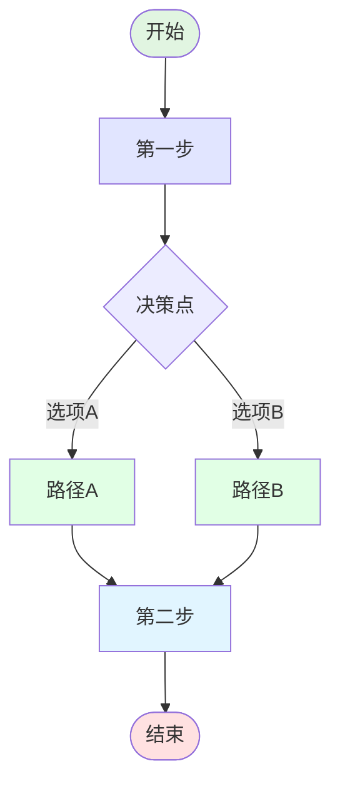
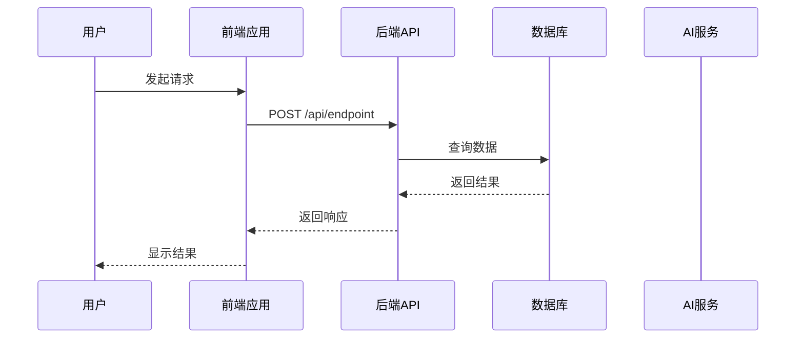
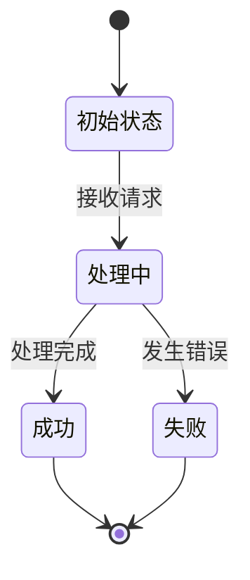
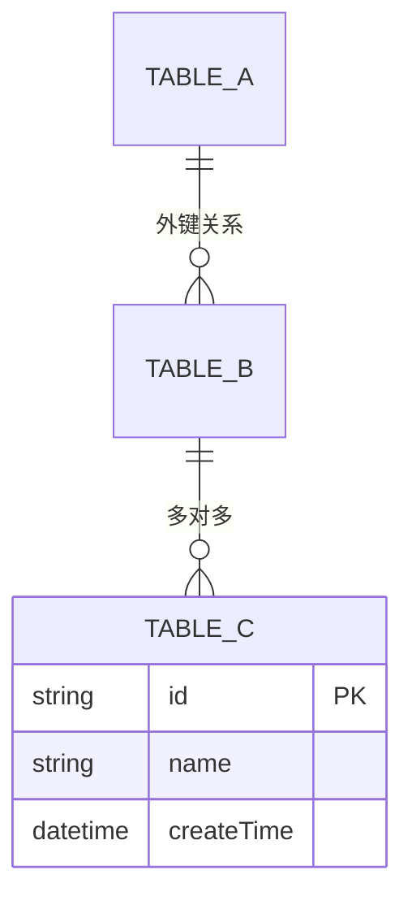
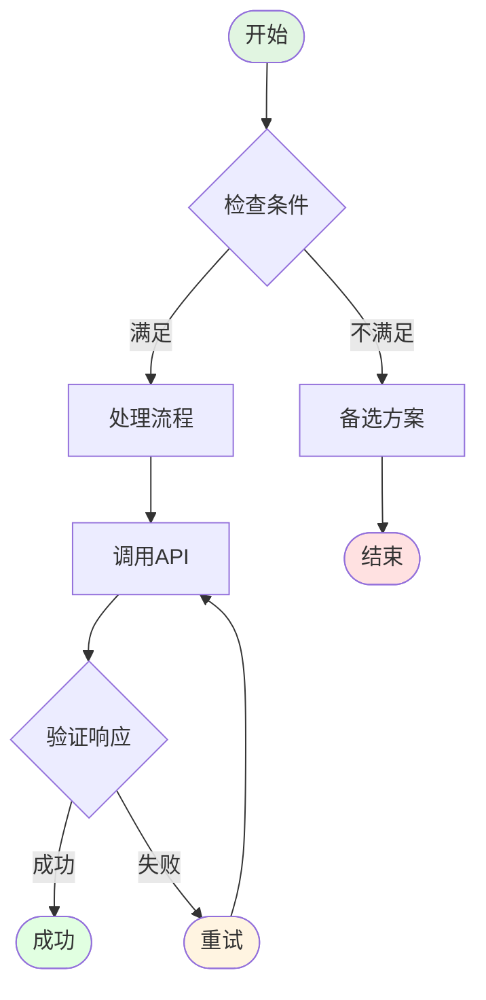
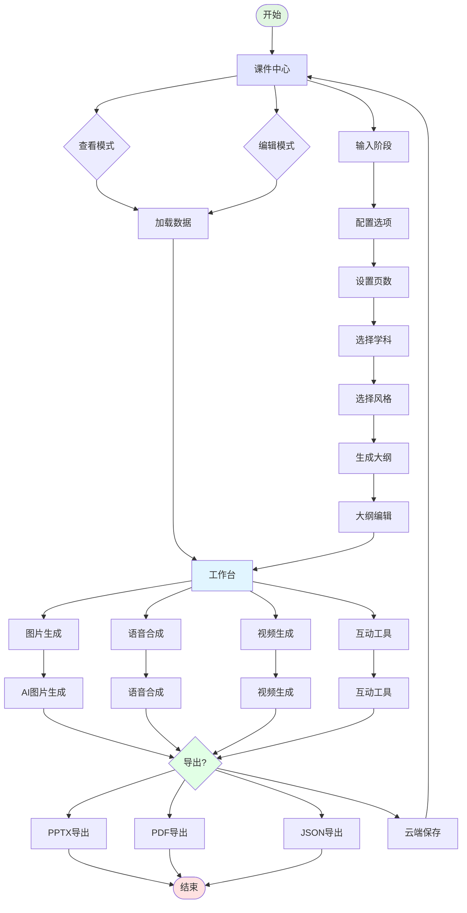
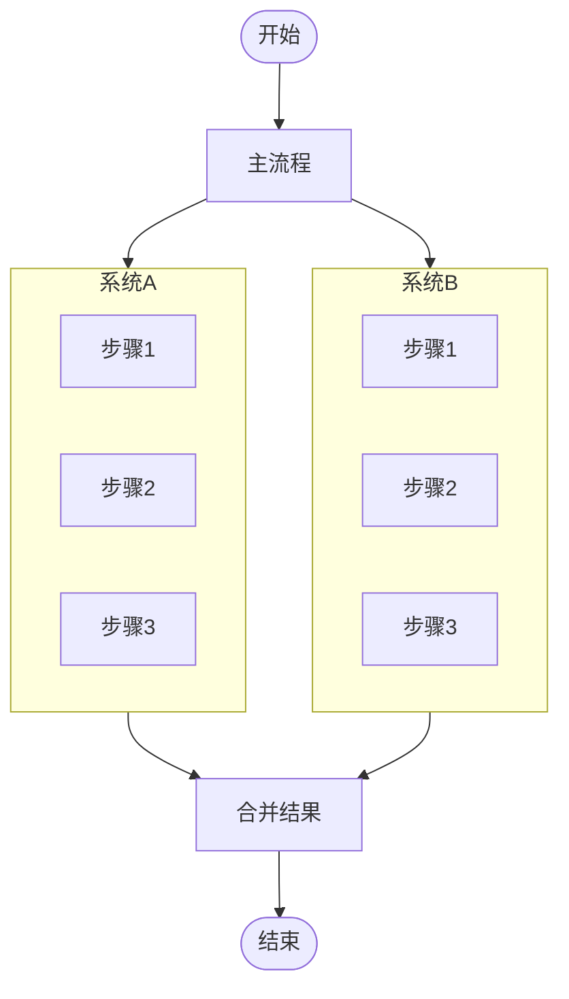
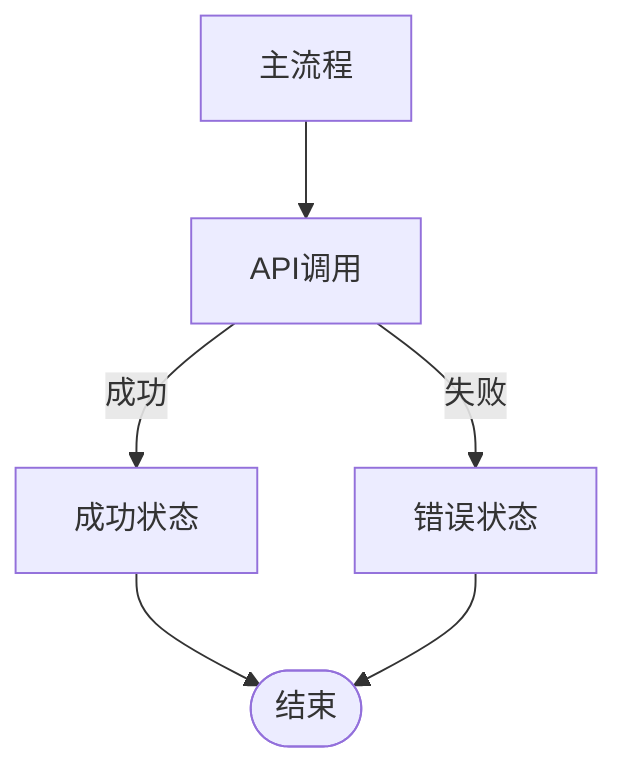
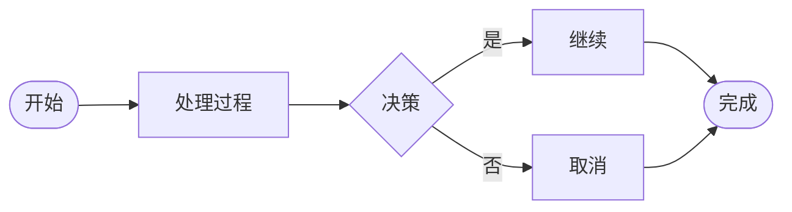
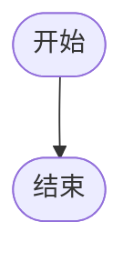

# {{TITLE}}

{{DESCRIPTION}}
{{QUICK_REFERENCE}}

## Prerequisites

No special prerequisites required. This skill works with standard Markdown and Mermaid syntax.

---

## How to Use This 流程图生成 Skill

When user requests to create workflow diagrams, flowcharts, sequence diagrams, or system architecture diagrams, follow this workflow:

### Step 1: Analyze User Requirements

Extract key information from user request:
- **Diagram type**: flowchart, sequence, state diagram, ER diagram, architecture
- **System name**: AI备课工具, 公司管理, etc.
- **Complexity level**: simple, medium, complex
- **Key components**: main stages, decision points, API calls, database operations
- **Style preference**: modern, professional, minimal, colorful

### Step 2: Select Diagram Template

Based on the requirements, choose the appropriate template:

**For Flowcharts (流程图):**


**For Sequence Diagrams (时序图):**


**For State Diagrams (状态机图):**


**For ER Diagrams (数据库关系图):**


### Step 3: Customize with Domain-Specific Elements

Add industry and system-specific elements:

**For AI/PPT Systems:**
- Image generation stages
- Voice synthesis steps
- Video processing flows
- Cloud save operations
- API integration points

**For Business Systems:**
- User authentication flows
- Data validation steps
- Permission checks
- Audit logging

**For Educational Systems:**
- Course creation flows
- Student management
- Resource allocation
- Assessment workflows

### Step 4: Add Styling and Colors

Apply consistent color scheme:

| Color | Purpose | Hex Code |
|-------|---------|----------|
| Primary | Main actions | `#e1f5e1` |
| Secondary | Alternative paths | `#e1ffe5` |
| Success | Completion states | `#e1ffe1` |
| Warning | Decision points | `#fff4e1` |
| Error | Failure states | `#ffe1e1` |
| Info | Information nodes | `#e1f5ff` |

**Node Styles:**
```mermaid
style Start fill:#e1f5e1
style End fill:#ffe1e1
style Process fill:#e1f5ff
style Decision fill:#fff4e1
style Success fill:#e1ffe1
style Error fill:#ffe1e1
```

### Step 5: Add Detailed Annotations

Include decision logic, API calls, and data flows:



### Step 6: Review and Optimize

Check for:
- Clear node naming conventions
- Consistent arrow directions
- Proper decision point labeling
- Complete error handling paths
- Appropriate complexity for the audience

---

## Diagram Type Reference

### Available Diagram Types

| Type | Use For | Mermaid Keyword |
|------|---------|---------------|
| `flowchart` | Process flows, decision trees | `flowchart TD` |
| `sequenceDiagram` | Time-based interactions | `sequenceDiagram` |
| `stateDiagram-v2` | State transitions | `stateDiagram-v2` |
| `erDiagram` | Database relationships | `erDiagram` |
| `classDiagram` | Class structures | `classDiagram` |
| `gantt` | Timeline planning | `gantt` |
| `pie` | Data distribution | `pie` |

### Common Flowchart Patterns

| Pattern | Description | Example |
|---------|-------------|---------|
| **Linear** | Simple sequential process | A → B → C → D |
| **Branching** | Decision-based paths | A → B{yes/no} → C/D |
| **Looping** | Repeated operations | A → B → C → B (loop) |
| **Parallel** | Concurrent tasks | A → B & C → D |
| **Feedback** | Return to previous step | A → B → C → B (if error) |

---

## Example Workflow

**User request:** "创建AI备课工具的主流程图，包含课件中心、工作台、图片生成、语音合成、视频生成和导出功能"

### Step 1: Analyze Requirements
- Diagram type: Flowchart
- System: AI备课工具
- Complexity: Medium
- Key stages: 6 main stages with sub-steps

### Step 2: Select Template

Use the main flowchart template with multiple decision points.

### Step 3: Customize for AI/PPT System

Add specific elements:
- AI service integration points
- Async task creation
- Polling mechanisms
- Cloud storage operations
- Multiple export formats

### Step 4: Apply Styling

Use professional color scheme with clear stage differentiation.

### Step 5: Add Detailed Annotations

Include API endpoints, status checks, and error handling.

### Step 6: Generate Final Diagram



---

## Best Practices

### Diagram Structure

1. **Start with clear entry point** - Always begin with `Start([开始])`
2. **Use descriptive node names** - Avoid abbreviations, use full Chinese descriptions
3. **Group related stages** - Use subgraphs or consistent positioning
4. **Add decision points** - Use diamond shape `{}` for branches
5. **Include error handling** - Show alternative paths for failures
6. **End with clear exit** - Always end with `End([结束])`

### Visual Design

1. **Consistent color scheme** - Use the same colors for similar node types
2. **Appropriate spacing** - Leave enough space between nodes
3. **Clear arrow directions** - Show flow direction clearly
4. **Readable text** - Ensure labels are legible on all backgrounds
5. **Professional appearance** - Avoid overly decorative elements

### Mermaid Syntax Tips

1. **Use correct diagram type** - `flowchart TD` for top-down flow
2. **Proper node syntax** - `NodeName[Label]` for rectangles
3. **Decision point syntax** - `DecisionName{Label}` for diamonds
4. **Start/End syntax** - `Start([Label])` and `End([Label])` for terminals
5. **Style syntax** - `style NodeName fill:#color` for custom colors
6. **Arrow syntax** - `-->` for connections, `-.->` for dotted lines

### Common Mistakes to Avoid

| Mistake | Why It's Bad | Fix |
|---------|---------------|-----|
| **Mixed languages** | Inconsistent naming | Use all Chinese or all English |
| **Unclear flows** | Hard to follow | Add clear labels and arrows |
| **Missing decisions** | No branching shown | Add decision points `{}` |
| **No error handling** | Single path only | Show alternative paths for failures |
| **Poor colors** | Hard to distinguish | Use consistent color scheme |
| **Too complex** | Overwhelming detail | Break into multiple diagrams |

---

## Advanced Features

### Subgraphs for Complex Systems

For large systems, use subgraphs to organize:



### Cross-References Between Diagrams

Show relationships between different diagram types:



### Interactive Elements

Add hover effects and click actions:



---

## Output Formats

This skill supports multiple output formats:

### Mermaid Code (Default)


### Markdown with Embedded Mermaid
```markdown
# 流程图

## 主流程


```

### ASCII Art (Alternative)
```
┌─────────┐
│  开始    │
└────┬────┘
     │
     ▼
┌─────────┐
│  处理    │
└────┬────┘
     │
     ▼
┌─────────┐
│  结束    │
└─────────┘
```

---

## Pre-Delivery Checklist

Before delivering the workflow diagram, verify these items:

### Content Accuracy
- [ ] All required stages are included
- [ ] Decision points are properly labeled
- [ ] Error handling paths are complete
- [ ] API endpoints are correct
- [ ] Database relationships are accurate

### Visual Quality
- [ ] Color scheme is consistent
- [ ] Node names are descriptive
- [ ] Arrows show clear flow direction
- [ ] Start and End points are clear
- [ ] Text is readable on all backgrounds

### Technical Correctness
- [ ] Mermaid syntax is valid
- [ ] No syntax errors or warnings
- [ ] Diagram renders correctly in preview
- [ ] All connections are logical
- [ ] No orphaned nodes

### Documentation
- [ ] Diagram has clear title
- [ ] Complex sections have explanations
- [ ] Decision logic is documented
- [ ] Color legend is provided (if needed)
- [ ] Example scenarios are included

---

## Tips for Better Results

1. **Start simple** - Begin with basic structure, add complexity gradually
2. **Use real data** - Reference actual system requirements and API specs
3. **Iterate frequently** - Generate, review, refine in cycles
4. **Get feedback** - Share with stakeholders for validation
5. **Keep templates** - Save successful patterns for reuse
6. **Stay updated** - Follow Mermaid best practices and new features