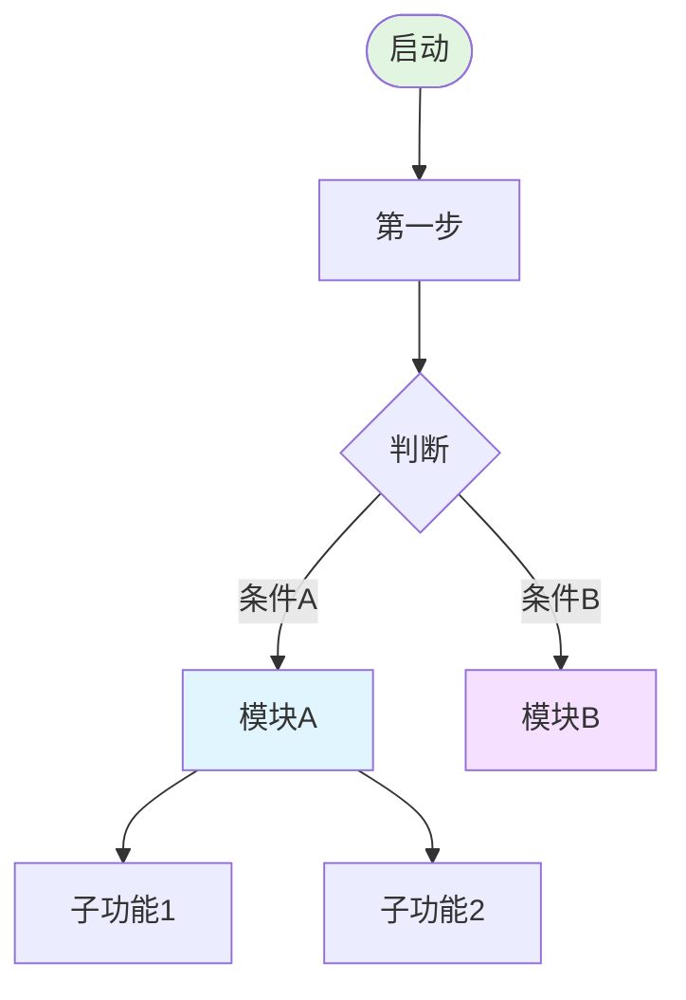
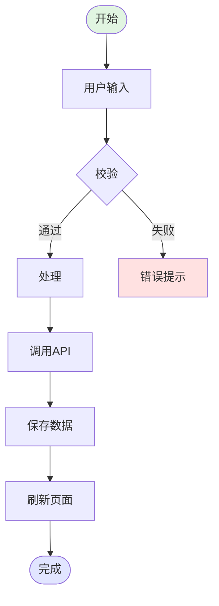
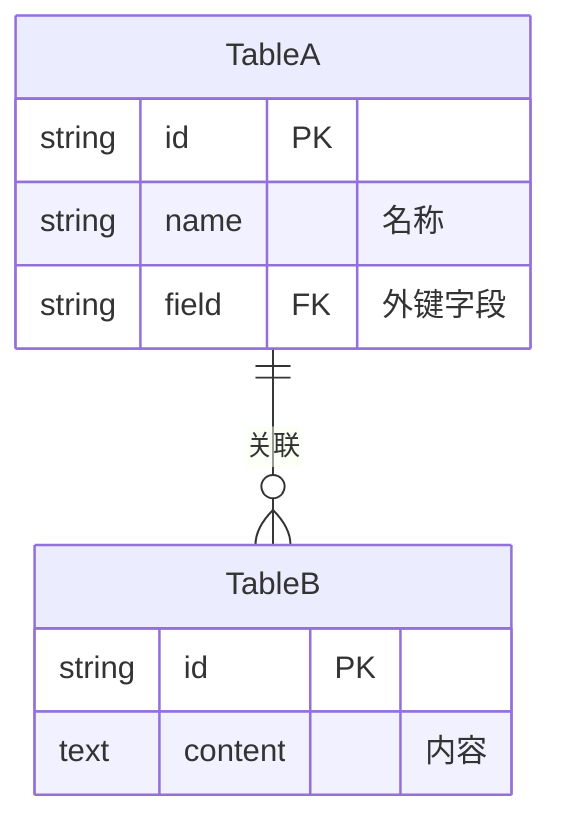
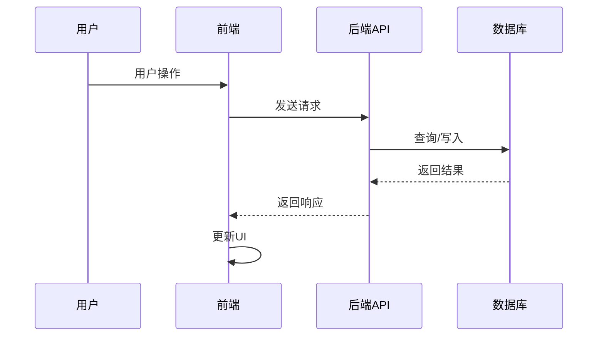
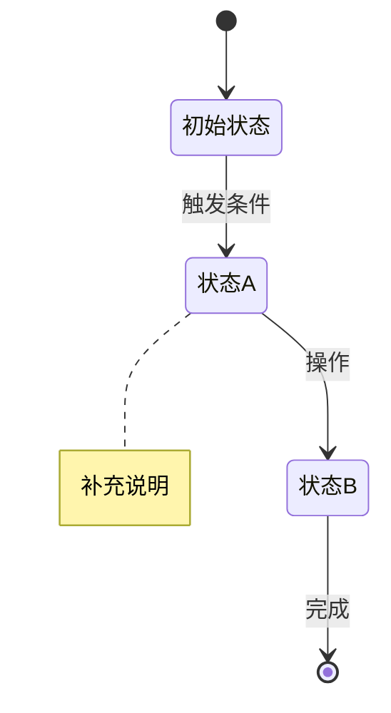
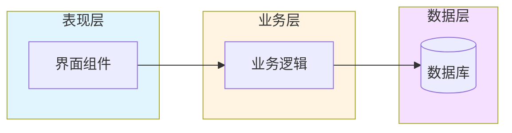

# 工作流程图生成技能

> 为项目生成完整的 Mermaid 工作流程图文档，输出到项目的 `docs/工作流程图.md`。

---

## 输出规范

每个工作流程图文档应包含以下 **7 类图表**（按需取用，至少包含前 3 类）：

### 1. 主流程图 (flowchart TD)

**必选**。展示应用从启动到各功能模块的完整导航路径。

**要求**：

- 从应用入口开始，覆盖所有主要功能模块
- 使用圆角矩形 `([...])` 标记起止点
- 使用菱形 `{...}` 标记分支判断
- 每个关键节点用 `style` 着色区分
- 模块名称使用 emoji 前缀增强可读性

### 2. 核心流程详细图 (flowchart TD)

**必选**。选取 1-3 个核心业务流程，展开详细步骤。

**要求**：

- 包含用户操作、系统处理、API 调用、错误处理各环节
- 使用 ` ` 在节点内换行补充说明

### 3. 数据库表关系图 (erDiagram)

**必选**（有数据库时）。展示所有数据表的字段和关联关系。

**要求**：

- 列出每张表的关键字段（类型 + 名称 + 备注）
- 标注 PK/FK 关系
- 使用 `||--o{`、`}o--o{` 等标记一对多、多对多

### 4. API 调用时序图 (sequenceDiagram)

**推荐**。展示前后端、第三方服务之间的调用时序。

**要求**：

- 使用 `Note over` 分隔不同业务场景
- 使用 `alt/loop` 展示条件/循环逻辑
- 标注关键的 HTTP 方法和路径

### 5. 状态机图 (stateDiagram-v2)

**推荐**。展示应用或业务实体的状态流转。

### 6. 架构图 (flowchart LR)

**推荐**。展示系统分层架构和模块依赖。

### 7. 特定模块详细流程

**可选**。针对复杂模块单独画详细流程。

---

## 配色规范

| 用途 | 颜色 | 示例 |
| :--- | :--- | :--- |
| 起始节点 | `#e1f5e1` | 浅绿 |
| 结束节点 | `#ffe1e1` | 浅红 |
| 主要模块 | `#e1e5ff` | 浅蓝紫 |
| 输入/表单 | `#fff4e1` | 浅橙 |
| 处理/逻辑 | `#e1f5ff` | 浅天蓝 |
| 存储/数据 | `#f5e1ff` | 浅紫 |
| 成功状态 | `#e1ffe1` | 浅绿 |
| 通用模块 | `#e1ffe5` | 浅薄荷 |

## 生成步骤

1. **读取项目架构文档**（如 `docs/architecture.md`、`README.md`）
2. **扫描代码结构**（路由、模块、数据库表定义）
3. **识别核心业务流程**（登录、CRUD、文件上传等）
4. **按 7 类图表逐一生成**，确保与代码逻辑一致
5. **输出到 `docs/工作流程图.md`**

## 参考示例

- [AI备课工具 工作流程图](../../../已完成项目/ai备课工具/工作流程图.md)
- [公司管理 工作流程图](../../../待完成项目/公司管理1.0.3/docs/工作流程图.md)
