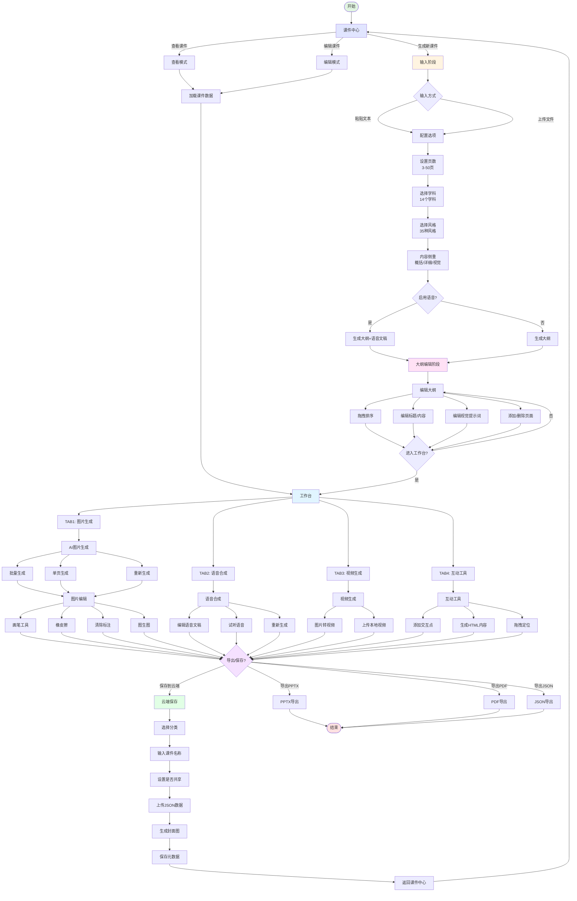
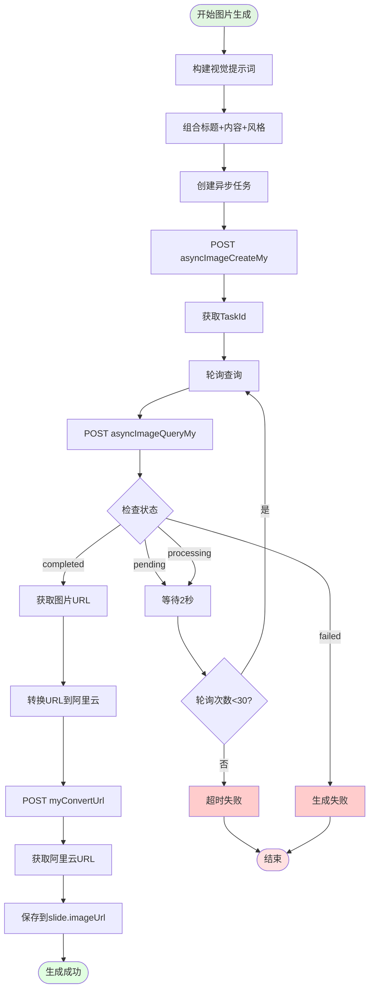
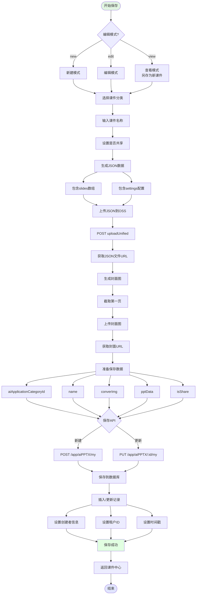
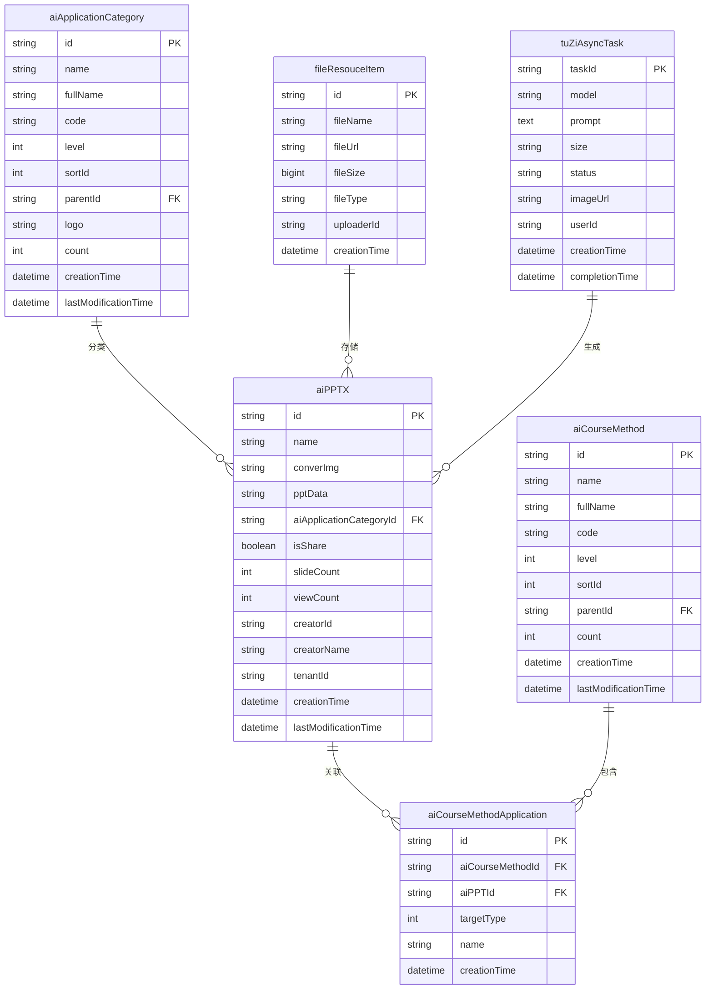
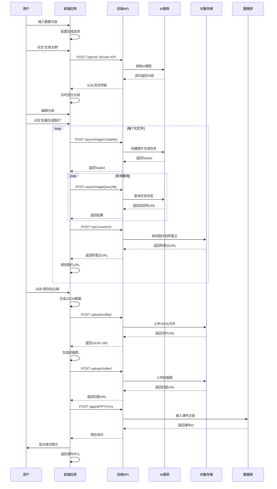
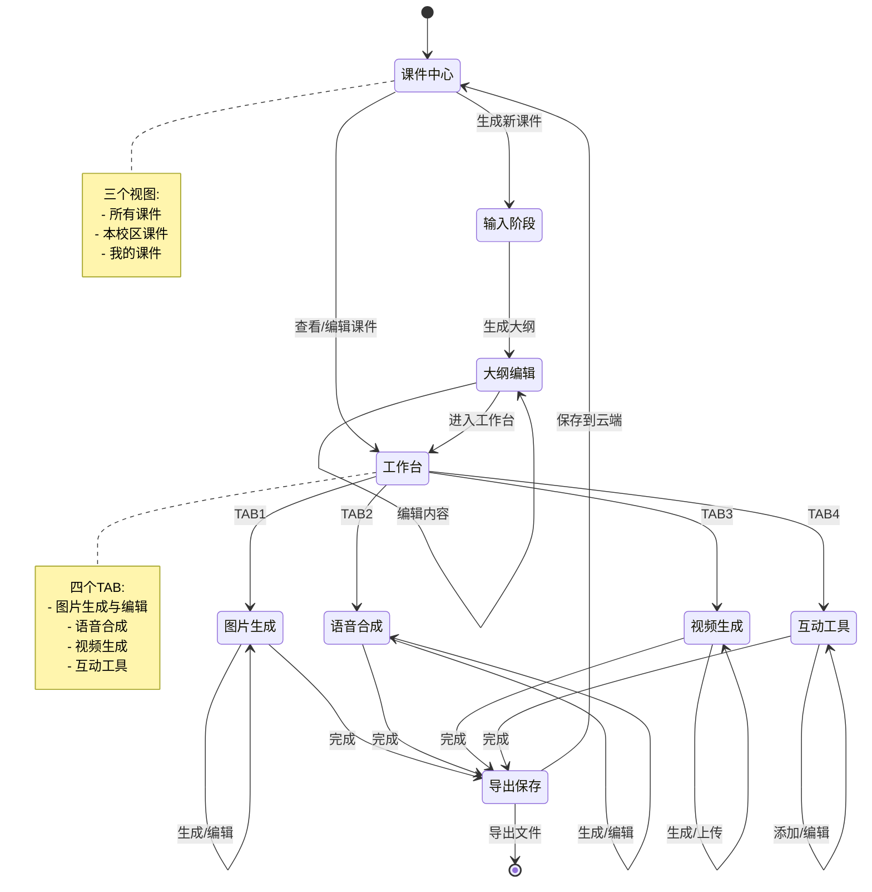

# AI备课工具 - 工作流程图

## 主流程图

```mermaid
flowchart TD
    Start([开始]) --> Center[课件中心]

    Center --> |查看课件| ViewMode[查看模式]
    Center --> |编辑课件| EditMode[编辑模式]
    Center --> |生成新课件| Input[输入阶段]

    ViewMode --> LoadData[加载课件数据]
    EditMode --> LoadData
    LoadData --> Workbench[工作台]

    Input --> InputText{输入方式}
    InputText --> |粘贴文本| Config[配置选项]
    InputText --> |上传文件| Config

    Config --> SetPages[设置页数<br/>3-50页]
    SetPages --> SetSubject[选择学科<br/>14个学科]
    SetSubject --> SetStyle[选择风格<br/>35种风格]
    SetStyle --> SetFocus[内容侧重<br/>概括/详细/视觉]
    SetFocus --> EnableVoice{启用语音?}

    EnableVoice --> |是| GenerateOutlineWithVoice[生成大纲+语音文稿]
    EnableVoice --> |否| GenerateOutline[生成大纲]

    GenerateOutlineWithVoice --> Outline[大纲编辑阶段]
    GenerateOutline --> Outline

    Outline --> EditOutline[编辑大纲]
    EditOutline --> DragSort[拖拽排序]
    EditOutline --> EditContent[编辑标题/内容]
    EditOutline --> EditPrompt[编辑视觉提示词]
    EditOutline --> AddDelete[添加/删除页面]

    DragSort --> ToWorkbench{进入工作台?}
    EditContent --> ToWorkbench
    EditPrompt --> ToWorkbench
    AddDelete --> ToWorkbench

    ToWorkbench --> |是| Workbench
    ToWorkbench --> |否| EditOutline

    Workbench --> Tab1[TAB1: 图片生成]
    Workbench --> Tab2[TAB2: 语音合成]
    Workbench --> Tab3[TAB3: 视频生成]
    Workbench --> Tab4[TAB4: 互动工具]

    Tab1 --> ImageGen[AI图片生成]
    ImageGen --> BatchGen[批量生成]
    ImageGen --> SingleGen[单页生成]
    ImageGen --> ReGen[重新生成]

    BatchGen --> ImageEdit[图片编辑]
    SingleGen --> ImageEdit
    ReGen --> ImageEdit

    ImageEdit --> DrawTool[画笔工具]
    ImageEdit --> EraserTool[橡皮擦]
    ImageEdit --> ClearTool[清除标注]
    ImageEdit --> Img2Img[图生图]

    Tab2 --> VoiceGen[语音合成]
    VoiceGen --> EditScript[编辑语音文稿]
    VoiceGen --> PlayVoice[试听语音]
    VoiceGen --> ReGenVoice[重新生成]

    Tab3 --> VideoGen[视频生成]
    VideoGen --> Img2Video[图片转视频]
    VideoGen --> UploadVideo[上传本地视频]

    Tab4 --> InteractiveTool[互动工具]
    InteractiveTool --> AddHotspot[添加交互点]
    InteractiveTool --> GenHTML[生成HTML内容]
    InteractiveTool --> DragPosition[拖拽定位]

    DrawTool --> Export{导出/保存?}
    EraserTool --> Export
    ClearTool --> Export
    Img2Img --> Export
    EditScript --> Export
    PlayVoice --> Export
    ReGenVoice --> Export
    Img2Video --> Export
    UploadVideo --> Export
    AddHotspot --> Export
    GenHTML --> Export
    DragPosition --> Export

    Export --> |导出PPTX| ExportPPTX[PPTX导出]
    Export --> |导出PDF| ExportPDF[PDF导出]
    Export --> |导出JSON| ExportJSON[JSON导出]
    Export --> |保存到云端| CloudSave[云端保存]

    CloudSave --> SelectCategory[选择分类]
    SelectCategory --> InputName[输入课件名称]
    InputName --> SetShare[设置是否共享]
    SetShare --> UploadJSON[上传JSON数据]
    UploadJSON --> GenCover[生成封面图]
    GenCover --> SaveMeta[保存元数据]
    SaveMeta --> BackCenter[返回课件中心]

    ExportPPTX --> End([结束])
    ExportPDF --> End
    ExportJSON --> End
    BackCenter --> Center

    style Start fill:#e1f5e1
    style End fill:#ffe1e1
    style Center fill:#e1e5ff
    style Input fill:#fff4e1
    style Outline fill:#ffe1f5
    style Workbench fill:#e1f5ff
    style Export fill:#f5e1ff
    style CloudSave fill:#e1ffe5
```

## 图片生成详细流程

```mermaid
flowchart TD
    Start([开始图片生成]) --> BuildPrompt[构建视觉提示词]
    BuildPrompt --> Combine[组合标题+内容+风格]
    Combine --> CreateTask[创建异步任务]

    CreateTask --> PostAPI[POST asyncImageCreateMy]
    PostAPI --> GetTaskId[获取TaskId]

    GetTaskId --> Poll[轮询查询]
    Poll --> PostQuery[POST asyncImageQueryMy]
    PostQuery --> CheckStatus{检查状态}

    CheckStatus --> |pending| Wait[等待2秒]
    CheckStatus --> |processing| Wait
    Wait --> PollCount{轮询次数<30?}
    PollCount --> |是| Poll
    PollCount --> |否| Timeout[超时失败]

    CheckStatus --> |completed| GetURL[获取图片URL]
    CheckStatus --> |failed| Error[生成失败]

    GetURL --> ConvertURL[转换URL到阿里云]
    ConvertURL --> PostConvert[POST myConvertUrl]
    PostConvert --> GetAliyunURL[获取阿里云URL]
    GetAliyunURL --> SaveURL[保存到slide.imageUrl]
    SaveURL --> Success([生成成功])

    Timeout --> End([结束])
    Error --> End

    style Start fill:#e1f5e1
    style Success fill:#e1ffe1
    style End fill:#ffe1e1
    style Timeout fill:#ffcccc
    style Error fill:#ffcccc
```

## 云端保存详细流程

```mermaid
flowchart TD
    Start([开始保存]) --> CheckMode{编辑模式?}

    CheckMode --> |new| NewMode[新建模式]
    CheckMode --> |edit| EditMode[编辑模式]
    CheckMode --> |view| ViewMode[查看模式<br/>另存为新课件]

    NewMode --> SelectCat[选择课件分类]
    EditMode --> SelectCat
    ViewMode --> SelectCat

    SelectCat --> InputName[输入课件名称]
    InputName --> SetShare[设置是否共享]

    SetShare --> GenJSON[生成JSON数据]
    GenJSON --> IncludeSlides[包含slides数组]
    GenJSON --> IncludeSettings[包含settings配置]

    IncludeSlides --> UploadJSON[上传JSON到OSS]
    IncludeSettings --> UploadJSON

    UploadJSON --> PostUpload[POST uploadUnified]
    PostUpload --> GetJSONURL[获取JSON文件URL]

    GetJSONURL --> GenCover[生成封面图]
    GenCover --> Screenshot[截取第一页]
    Screenshot --> UploadCover[上传封面图]
    UploadCover --> GetCoverURL[获取封面URL]

    GetCoverURL --> PrepareData[准备保存数据]
    PrepareData --> SetCategoryId[aiApplicationCategoryId]
    PrepareData --> SetName[name]
    PrepareData --> SetCoverImg[converImg]
    PrepareData --> SetPPTData[pptData]
    PrepareData --> SetIsShare[isShare]

    SetCategoryId --> SaveAPI{保存API}
    SetName --> SaveAPI
    SetCoverImg --> SaveAPI
    SetPPTData --> SaveAPI
    SetIsShare --> SaveAPI

    SaveAPI --> |新建| PostCreate[POST /app/aiPPTX/my]
    SaveAPI --> |更新| PutUpdate[PUT /app/aiPPTX/:id/my]

    PostCreate --> SaveDB[保存到数据库]
    PutUpdate --> SaveDB

    SaveDB --> InsertRecord[插入/更新记录]
    InsertRecord --> SetCreator[设置创建者信息]
    InsertRecord --> SetTenant[设置租户ID]
    InsertRecord --> SetTimestamp[设置时间戳]

    SetCreator --> Success[保存成功]
    SetTenant --> Success
    SetTimestamp --> Success

    Success --> BackCenter[返回课件中心]
    BackCenter --> End([结束])

    style Start fill:#e1f5e1
    style Success fill:#e1ffe1
    style End fill:#e1e5ff
```

## 数据库表关系图

```mermaid
erDiagram
    aiPPTX ||--o{ aiCourseMethodApplication : "关联"
    aiApplicationCategory ||--o{ aiPPTX : "分类"
    aiCourseMethod ||--o{ aiCourseMethodApplication : "包含"
    fileResouceItem ||--o{ aiPPTX : "存储"
    tuZiAsyncTask ||--o{ aiPPTX : "生成"

    aiPPTX {
        string id PK
        string name
        string converImg
        string pptData
        string aiApplicationCategoryId FK
        boolean isShare
        int slideCount
        int viewCount
        string creatorId
        string creatorName
        string tenantId
        datetime creationTime
        datetime lastModificationTime
    }

    aiApplicationCategory {
        string id PK
        string name
        string fullName
        string code
        int level
        int sortId
        string parentId FK
        string logo
        int count
        datetime creationTime
        datetime lastModificationTime
    }

    aiCourseMethod {
        string id PK
        string name
        string fullName
        string code
        int level
        int sortId
        string parentId FK
        int count
        datetime creationTime
        datetime lastModificationTime
    }

    aiCourseMethodApplication {
        string id PK
        string aiCourseMethodId FK
        string aiPPTId FK
        int targetType
        string name
        datetime creationTime
    }

    fileResouceItem {
        string id PK
        string fileName
        string fileUrl
        bigint fileSize
        string fileType
        string uploaderId
        datetime creationTime
    }

    tuZiAsyncTask {
        string taskId PK
        string model
        text prompt
        string size
        string status
        string imageUrl
        string userId
        datetime creationTime
        datetime completionTime
    }
```

## API调用时序图

```mermaid
sequenceDiagram
    participant U as 用户
    participant F as 前端应用
    participant API as 后端API
    participant AI as AI服务
    participant OSS as 对象存储
    participant DB as 数据库

    U->>F: 输入教案内容
    F->>F: 配置生成选项
    U->>F: 点击"生成大纲"

    F->>API: POST OpenAI Stream API
    API->>AI: 调用AI模型
    AI-->>API: 流式返回大纲
    API-->>F: SSE流式传输
    F->>F: 实时显示大纲

    U->>F: 编辑大纲
    U->>F: 点击"批量生成图片"

    loop 每个幻灯片
        F->>API: POST asyncImageCreateMy
        API->>AI: 创建图片生成任务
        AI-->>API: 返回TaskId
        API-->>F: 返回TaskId

        loop 轮询查询
            F->>API: POST asyncImageQueryMy
            API->>AI: 查询任务状态
            AI-->>API: 返回状态和URL
            API-->>F: 返回结果
        end

        F->>API: POST myConvertUrl
        API->>OSS: 转存图片到阿里云
        OSS-->>API: 返回阿里云URL
        API-->>F: 返回阿里云URL
        F->>F: 保存图片URL
    end

    U->>F: 点击"保存到云端"
    F->>F: 生成JSON数据

    F->>API: POST uploadUnified
    API->>OSS: 上传JSON文件
    OSS-->>API: 返回文件URL
    API-->>F: 返回JSON URL

    F->>F: 生成封面图
    F->>API: POST uploadUnified
    API->>OSS: 上传封面图
    OSS-->>API: 返回封面URL
    API-->>F: 返回封面URL

    F->>API: POST /app/aiPPTX/my
    API->>DB: 插入课件记录
    DB-->>API: 返回课件ID
    API-->>F: 保存成功

    F->>U: 显示成功提示
    F->>F: 返回课件中心
```

## 状态机图

```mermaid
stateDiagram-v2
    [*] --> 课件中心

    课件中心 --> 输入阶段: 生成新课件
    课件中心 --> 工作台: 查看/编辑课件

    输入阶段 --> 大纲编辑: 生成大纲

    大纲编辑 --> 大纲编辑: 编辑内容
    大纲编辑 --> 工作台: 进入工作台

    工作台 --> 图片生成: TAB1
    工作台 --> 语音合成: TAB2
    工作台 --> 视频生成: TAB3
    工作台 --> 互动工具: TAB4

    图片生成 --> 图片生成: 生成/编辑
    语音合成 --> 语音合成: 生成/编辑
    视频生成 --> 视频生成: 生成/上传
    互动工具 --> 互动工具: 添加/编辑

    图片生成 --> 导出保存: 完成
    语音合成 --> 导出保存: 完成
    视频生成 --> 导出保存: 完成
    互动工具 --> 导出保存: 完成

    导出保存 --> [*]: 导出文件
    导出保存 --> 课件中心: 保存到云端

    note right of 课件中心
        三个视图:
        - 所有课件
        - 本校区课件
        - 我的课件
    end note

    note right of 工作台
        四个TAB:
        - 图片生成与编辑
        - 语音合成
        - 视频生成
        - 互动工具
    end note
```
