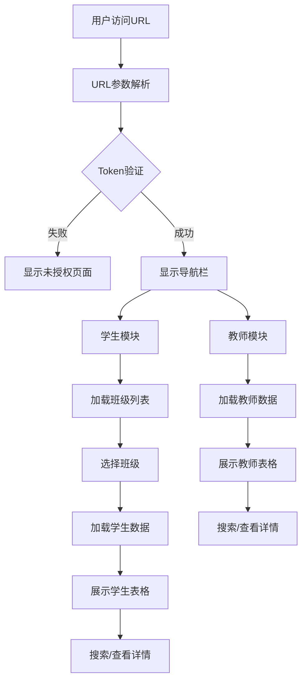

# 学生老师信息管理系统 - 项目概览

> **版本**: 1.0  
> **状态**: 🚧 开发中 - 存在已知问题  
> **创建时间**: 2026-01-05  
> **最后更新**: 2026-01-10

---

## 📋 项目简介

这是一个基于Web的**学生老师信息管理系统**，用于学校管理和展示学生、教师信息。系统采用纯前端架构，通过REST API与后端服务通信，使用OAuth 2.0进行身份认证。

### 核心特性

- ✅ **双模块系统**: 学生管理 + 教师管理
- ✅ **URL参数授权**: 通过URL传递认证信息
- ✅ **班级分类**: 按班级组织学生信息
- ✅ **搜索功能**: 实时搜索学生/教师
- ✅ **详情查看**: 弹窗展示详细信息
- ✅ **响应式设计**: 适配多种屏幕
- ⚠️ **分页功能**: 未实现（待开发）

---

## 🏗️ 技术架构

### 技术栈

| 层级 | 技术 | 说明 |
|------|------|------|
| **前端框架** | Vanilla JavaScript | 无框架，纯原生JS |
| **UI层** | HTML5 + CSS3 | 深色主题 + 玻璃态效果 |
| **数据通信** | Fetch API | RESTful API调用 |
| **认证** | OAuth 2.0 + JWT | Bearer Token授权 |
| **样式** | 自定义CSS | 响应式布局 |

### 系统架构图



---

## 📁 项目文件结构

```
学生老师的链接-1.0/
├── index.html              # 主页面（148行）
│   ├── 未授权提示页面
│   ├── 教师信息界面
│   ├── 班级选择界面
│   ├── 学生信息界面
│   ├── 详情模态框
│   └── 底部导航栏
│
├── script.js              # 核心逻辑（648行）
│   ├── 全局变量管理
│   ├── URL参数解析
│   ├── 授权检查
│   ├── API调用封装
│   ├── 数据渲染
│   ├── 搜索过滤
│   └── 事件处理
│
├── styles.css             # 样式文件（17981字节）
│   ├── 深色主题配色
│   ├── 玻璃态效果
│   ├── 响应式布局
│   ├── 动画效果
│   └── 组件样式
│
├── test-launcher.html     # 测试启动器（9507字节）
│   └── 用于调试的参数填写页面
│
├── README.md             # 使用文档（233行）
├── API接口文档.md         # API详细说明（251行）
└── 项目概览.md            # 本文档
```

---

## 🔑 URL参数系统

### 参数说明

系统通过以下URL参数接收配置和认证信息：

| 参数名 | 说明 | 类型 | 必需 | 示例 |
|--------|------|------|------|------|
| `type` | 租户英文名称 | String | ✅ | `jj4x-api` |
| `tenant` | 租户ID | UUID | ✅ | `c1863285-25d1-44fe-805c-5ddf611f83d3` |
| `author` | 用户中文名 | String | ✅ | `官方` |
| `userid` | 用户ID | UUID | ✅ | `c45eda39-6b24-5b82-0646-3a1e90ad2a1c` |
| `username` | 用户名 | String | ✅ | `罗文彬` |
| `token` | 访问令牌 | JWT | ✅ | `eyJhbGci...` |
| `teachertoken` | 教师令牌 | JWT | ⚠️ 可选 | - |

### 完整URL示例

```
index.html?type=jj4x-api&tenant=c1863285-25d1-44fe-805c-5ddf611f83d3&author=官方&userid=c45eda39-6b24-5b82-0646-3a1e90ad2a1c&username=罗文彬&token=eyJhbGci...&teachertoken=teacher_token_123
```

### 参数处理逻辑

```javascript
// 位置: script.js, 行32-67
function parseURLParams() {
    // 清空旧值，强制从URL重新读取
    // 使用 URLSearchParams 解析
    // 使用 decodeURIComponent 解码中文
    // 存储到全局变量 globalParams
}
```

---

## 🌐 API接口详情

### API基础配置

- **OAuth服务器**: `https://oauth.mamale.vip`
- **API基础URL**: `https://{type}.mamale.vip/api/app/`
- **认证方式**: Bearer Token
- **Content-Type**: `application/json`

### 接口列表

#### 1️⃣ 班级列表接口

```javascript
// URL: GET https://{type}.mamale.vip/api/app/class
// 代码位置: script.js, 行95-139, 函数 loadClassList()

// 返回格式
{
  "items": [
    {
      "id": 1,                    // 班级ID（重要：用于查询学生）
      "name": "一年级1班",         // 班级名称
      "grade": "一年级",          // 年级
      "studentCount": 30          // 学生数量
    }
  ],
  "totalCount": 10
}
```

#### 2️⃣ 学生列表接口

```javascript
// URL: GET https://{type}.mamale.vip/api/app/student/byClssId?ClassId={classId}
// 代码位置: script.js, 行196-244, 函数 loadStudentData()
// ⚠️ 注意: URL拼写是 byClssId（Class少了一个'a'）

// 返回格式
{
  "items": [
    {
      "id": "S001",
      "studentId": "20240101",      // 学号
      "name": "张三",               // 姓名
      "studentName": "张三",        // 别名字段
      "class": "一年级1班",
      "className": "一年级1班",
      "grade": "一年级",
      "status": "active",           // 或 isActive: true
      "phone": "13800138000",
      "email": "zhangsan@example.com",
      "enrollmentDate": "2024-09-01"
    }
  ]
}
```

#### 3️⃣ 教师列表接口

```javascript
// URL: GET https://{type}.mamale.vip/api/app/teacher
// 代码位置: script.js, 行249-296, 函数 loadTeacherData()

// 返回格式
{
  "totalCount": 3,
  "items": [
    {
      "id": "c1d8f...",             // 教师ID（UUID）
      "name": "雷老师",
      "tel": "18859773999",
      "schoolSubjectNames": "语文",  // 任教科目
      "classDtos": [                // 任教班级数组
        {
          "name": "一年级1班"
        }
      ],
      "status": 1,                  // 1-在职, 0-离职
      "isJury": false,              // 是否评审
      "userId": "...",
      "creationTime": "..."
    }
  ]
}
```

---

## ✨ 核心功能模块

### 1. 授权检查模块

```javascript
// 文件: script.js
// 函数: checkAuthorization() (行72-90)

功能：检查URL参数中的token是否存在
逻辑：
  - 如果token不存在或为'null' → 显示未授权页面
  - 如果token存在 → 显示主界面

授权流程：
  parseURLParams() → checkAuthorization() → 显示对应界面
```

### 2. 数据加载模块

```javascript
// 班级数据加载
loadClassList()           // 行95-139
  ↓
renderClassGrid()        // 行144-177
  ↓
用户点击班级卡片
  ↓
selectClass(classId)     // 行182-191

// 学生数据加载
loadStudentData(classId) // 行196-244
  ↓
updateStats()            // 行301-304
  ↓
renderStudentTable()     // 行309-344

// 教师数据加载
loadTeacherData()        // 行249-296
  ↓
updateTeacherStats()     // 行519-522
  ↓
renderTeacherTable()     // 行527-568
```

### 3. 搜索过滤模块

```javascript
// 学生搜索
filterStudents()         // 行349-365
功能：按姓名或学号实时搜索
触发：oninput事件

// 教师搜索
filterTeachers()         // 行573-589
功能：按姓名或科目实时搜索
触发：oninput事件
```

### 4. 详情查看模块

```javascript
// 学生详情
viewStudentDetails(studentId)  // 行370-420
  ↓
显示模态框（包含8个详细信息字段）

// 教师详情
viewTeacherDetails(teacherId)  // 行594-639
  ↓
显示模态框（包含6个详细信息字段）
```

### 5. 导航切换模块

```javascript
// 底部导航栏（行124-127）
[👨‍🎓 学生] [👨‍🏫 教师]

// 切换函数
showClassSelection()     // 行469-482 (学生模块)
showTeacherList()        // 行456-464 (教师模块)
backToClassSelection()   // 行432-438 (返回班级)
```

---

## ⚠️ 已知问题

根据项目文件夹命名和代码分析，存在以下**未解决问题**：

### 🔴 问题1: 人数不匹配

**描述**: 班级卡片显示的学生数量与实际加载的学生数量不一致

**可能原因**:
1. API返回的 `studentCount` 字段数据不准确
2. 前端统计逻辑与后端数据源不同步
3. 活跃/非活跃学生的统计方式不同

**影响位置**:
- 班级卡片显示: `renderClassGrid()` (行168-170)
- 学生统计: `updateStats()` (行301-304)

**建议解决方案**:
```javascript
// 方案1: 前端实时统计
loadStudentData(classId).then(() => {
  // 更新对应班级的真实学生数
  const realCount = allStudents.length;
  updateClassCardCount(classId, realCount);
});

// 方案2: 后端修复
// 联系后端开发确保 studentCount 字段准确
```

---

### 🔴 问题2: 需要翻页功能

**描述**: 当前系统**没有分页逻辑**，一次性加载所有数据

**影响**:
- 数据量大时页面加载慢
- 性能问题（DOM节点过多）
- 用户体验差

**当前状态**:
- ❌ 无分页控件
- ❌ 无分页API参数
- ❌ 无懒加载

**需要实现的功能**:
1. **API层**: 添加分页参数（`page`, `pageSize`）
2. **UI层**: 添加分页控件（[上一页] [1] [2] [3] [下一页]）
3. **逻辑层**: 实现页码跳转和数据加载

**建议实现**:
```javascript
// API调用示例
async function loadStudentData(classId, page = 1, pageSize = 20) {
  const url = `${API_CONFIG.getStudentByClassURL()}?ClassId=${classId}&page=${page}&pageSize=${pageSize}`;
  // ...
}

// 分页控件
<div class="pagination">
  <button onclick="loadPage(currentPage - 1)">上一页</button>
  <span>第 {currentPage} 页 / 共 {totalPages} 页</span>
  <button onclick="loadPage(currentPage + 1)">下一页</button>
</div>
```

---

### 🟡 其他潜在问题

#### 3. API拼写错误
- URL中的 `byClssId`（正确应为 `byClassId`）
- 位置: `script.js` 行25
- 影响: 代码可读性差，但不影响功能（后端已适配）

#### 4. 缺少Token过期处理
- 当前未处理401授权失败的情况
- 建议添加Token刷新逻辑或重新登录提示

#### 5. 无数据缓存机制
- 每次切换都重新请求API
- 建议添加缓存（LocalStorage或内存缓存）

---

## 🎨 UI设计特色

### 配色方案（深色主题）

```css
/* 主要颜色 */
背景色: 深灰色 (#1a1a2e, #16213e)
主色调: 蓝紫色渐变
文字色: 白色/浅灰色
边框色: 半透明白色

/* 状态颜色 */
活跃/在职: 绿色 (#4ade80)
非活跃/离职: 橙色 (#fb923c)
```

### 效果特性

- **玻璃态效果**: `backdrop-filter: blur(10px)`
- **渐变背景**: 线性渐变、径向渐变
- **悬停动画**: `transform: translateY(-5px)`
- **阴影效果**: 多层阴影叠加
- **过渡动画**: `transition: all 0.3s ease`

### 响应式断点

```css
/* 移动端 */
@media (max-width: 768px) {
  .class-grid { grid-template-columns: 1fr; }
  .student-table { font-size: 14px; }
}

/* 平板 */
@media (min-width: 769px) and (max-width: 1024px) {
  .class-grid { grid-template-columns: repeat(2, 1fr); }
}

/* 桌面 */
@media (min-width: 1025px) {
  .class-grid { grid-template-columns: repeat(3, 1fr); }
}
```

---

## 🔧 开发调试

### 使用测试启动器

```bash
1. 打开 test-launcher.html
2. 填写所有必需参数（已预填示例数据）
3. 点击"启动系统"按钮
```

### 直接URL访问

```
index.html?type=jj4x-api&tenant=...&token=...
```

### 控制台调试信息

系统会在浏览器控制台输出：
- ✅ URL参数解析结果
- ✅ API请求URL
- ✅ API返回数据
- ❌ 错误信息

---

## 📝 代码关键点

### 全局变量

```javascript
// script.js, 行2-19
const globalParams = {     // URL参数存储
  type, tenant, author, userid, username, token, teachertoken
};

let allClasses = [];       // 所有班级数据
let allStudents = [];      // 当前班级学生数据
let filteredStudents = []; // 搜索过滤后的学生
let allTeachers = [];      // 所有教师数据
let filteredTeachers = []; // 搜索过滤后的教师
let currentClassId = null; // 当前选中的班级ID
```

### 初始化流程

```javascript
// script.js, 行487-502
window.addEventListener('DOMContentLoaded', () => {
  parseURLParams();              // 1. 解析URL参数
  const isAuthorized = checkAuthorization(); // 2. 检查授权
  if (isAuthorized) {
    document.getElementById('navBar').style.display = 'flex'; // 3. 显示导航
    loadClassList();             // 4. 加载班级列表
  }
});
```

### API动态URL生成

```javascript
// script.js, 行22-30
const API_CONFIG = {
  getClassListURL: () => `https://${globalParams.type}.mamale.vip/api/app/class`,
  getStudentByClassURL: () => `https://${globalParams.type}.mamale.vip/api/app/student/byClssId`,
  getTeacherURL: () => `https://${globalParams.type}.mamale.vip/api/app/teacher`,
};
```

---

## 🚀 下一步开发计划

### 优先级1: 🔴 高优先级

- [ ] **实现分页功能**
  - [ ] 修改API调用添加分页参数
  - [ ] 设计分页UI组件
  - [ ] 实现页码跳转逻辑
  - [ ] 添加"每页显示数量"选择

- [ ] **修复人数统计问题**
  - [ ] 对比API返回数据与实际统计
  - [ ] 协调前后端统计逻辑
  - [ ] 添加数据一致性验证

### 优先级2: 🟡 中优先级

- [ ] **性能优化**
  - [ ] 添加数据缓存机制
  - [ ] 实现虚拟滚动（长列表优化）
  - [ ] 优化DOM操作减少重绘

- [ ] **用户体验提升**
  - [ ] 添加加载骨架屏
  - [ ] 优化错误提示信息
  - [ ] 添加数据为空的友好提示

### 优先级3: 🟢 低优先级

- [ ] **代码优化**
  - [ ] 修正API URL拼写
  - [ ] 添加TypeScript类型定义
  - [ ] 代码模块化重构

- [ ] **功能增强**
  - [ ] 添加数据导出功能（Excel）
  - [ ] 批量操作（批量删除、编辑）
  - [ ] 高级筛选（多条件组合）

---

## 📧 联系与支持

**技术栈**: HTML5 + CSS3 + JavaScript  
**认证**: OAuth 2.0 + JWT Token  
**API服务器**: `https://{type}.mamale.vip`  
**OAuth服务器**: `https://oauth.mamale.vip`

---

## 📌 重要提醒

> ⚠️ **当前版本存在已知问题，不建议直接用于生产环境**

1. **分页功能缺失** - 大数据量会导致性能问题
2. **人数统计不准** - 显示数据可能不一致
3. **缺少错误处理** - Token过期等异常情况未处理

**建议**: 先完成分页功能和人数统计修复后再部署使用。

---

## 🔗 相关项目技术问题

### 记账项目 - Electron Builder 构建问题

**问题描述**: 在构建 Electron 应用时遇到符号链接权限错误

**错误信息**:
```
ERROR: Cannot create symbolic link : 客户端没有所需的特权
C:\Users\lwb\AppData\Local\electron-builder\Cache\winCodeSign\xxx\darwin\10.12\lib\libcrypto.dylib
```

**根本原因**: Windows 系统默认需要管理员权限才能创建符号链接，electron-builder 在解压 winCodeSign 工具时会尝试创建 macOS 相关的符号链接

**解决方案（优先级排序）**:

1. **启用 Windows 开发者模式**（一次性设置，推荐 ⭐）
   ```
   设置 → 隐私和安全性 → 开发者选项 → 开启"开发人员模式"
   ```
   或使用 PowerShell 管理员命令：
   ```powershell
   reg add "HKEY_LOCAL_MACHINE\SOFTWARE\Microsoft\Windows\CurrentVersion\AppModelUnlock" /t REG_DWORD /f /v "AllowDevelopmentWithoutDevLicense" /d "1"
   ```

2. **清除缓存并重试**
   ```powershell
   Remove-Item -Recurse -Force "$env:LOCALAPPDATA\electron-builder\Cache\winCodeSign"
   npm run build
   ```

3. **以管理员身份运行**
   ```powershell
   # 右键 PowerShell → 以管理员身份运行
   cd G:\个人\编程项目\记账
   npm run build
   ```

4. **跳过代码签名**（临时方案）
   ```json
   // package.json
   {
     "build": {
       "win": {
         "sign": null
       }
     }
   }
   ```

**记录时间**: 2026-01-10 17:40  
**状态**: 已提供解决方案，待用户验证

---

**文档最后更新**: 2026-01-10 17:41  
**下次需要关注**: 分页功能实现进度
