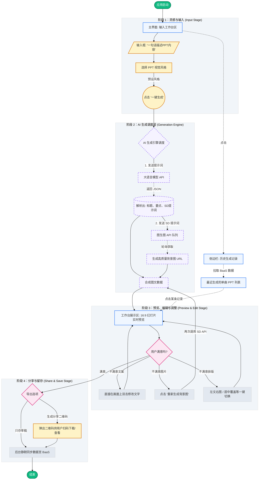

# 一句话生一张PPT - 用户使用流程导图

## 导图功能说明

1. **极简输入 (阶段 1)**：用户最大的痛点是“不想排版”，因此核心主张是 **“One Input -> One Slide”**。只需一句话和一个风格点选即可进入核心流程。
2. **黑盒生成 (阶段 2)**：大模型充当“文案策划”与“视觉导演”；SD 模型充当“绘图师”。用户在此期间只需看到优雅的 Loading 动画。
3. **微调编辑器 (阶段 3)**：不提供繁重复杂的编辑器工具（如各种属性面板）。采用所见即所得的极简模式，文字直接双击编辑，背景图通过一个按钮盲盒式再生成，排版布局一键切换。
4. **端云结合 (阶段 4)**：最终成果作为本地图片或 PDF 导出；结构化的数据在后台静默上报 BaaS 记录中心，提供历史追溯功能。
