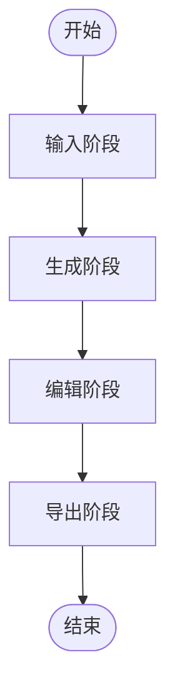

# 一句话生一张PPT系统设计方案

## 1. 系统架构

### 1.1 核心架构

基于AI备课工具的逻辑，设计一个简化版的"一句话生一张PPT"系统，架构如下：



### 1.2 技术栈

- **桌面应用框架**：Electron
- **前端**：React 18 + TypeScript + Tailwind CSS
- **构建工具**：Vite
- **路由管理**：React Router
- **AI服务**：OpenAI API (文本生成) + Stable Diffusion API (图像生成)
- **状态管理**：React useState
- **存储**：LocalStorage (本地存储)

## 2. 工作流程

### 2.1 输入阶段

1. **用户输入**：
   - 一句话描述（PPT内容主题）
   - PPT风格选择
   - 内容类型选择（标题、列表、图表等）

2. **配置选项**：
   - 风格选择（预设风格列表）
   - 内容布局选择
   - 配色方案选择

### 2.2 生成阶段

1. **AI生成内容**：
   - 调用OpenAI API生成PPT内容
   - 生成标题、要点内容
   - 生成适合的视觉提示词

2. **AI生成图片**：
   - 调用Stable Diffusion API生成背景图片
   - 根据风格和内容生成匹配的图像

### 2.3 编辑阶段

1. **内容编辑**：
   - 编辑标题和内容
   - 调整字体和样式

2. **图片编辑**：
   - 重新生成图片
   - 调整图片位置和大小

### 2.4 导出阶段

1. **导出选项**：
   - 导出为图片
   - 导出为PDF
   - 复制到剪贴板

2. **保存选项**：
   - 保存到本地

## 3. 核心功能模块

### 3.1 输入模块

- **功能**：接收用户输入的一句话描述和风格选择
- **组件**：
  - 文本输入框（一句话描述）
  - 风格选择下拉菜单
  - 内容类型选择
  - 生成按钮

### 3.2 生成模块

- **功能**：调用AI生成PPT内容和图片
- **组件**：
  - 生成状态指示
  - 生成进度条
  - 取消按钮

### 3.3 编辑模块

- **功能**：允许用户编辑PPT内容和图片
- **组件**：
  - 标题编辑器
  - 内容编辑器
  - 图片编辑工具
  - 重新生成按钮

### 3.4 导出模块

- **功能**：支持导出PPT为图片或PDF
- **组件**：
  - 导出格式选择
  - 导出按钮
  - 保存选项

## 4. 用户界面设计

### 4.1 页面结构

1. **输入页面**：
   - 简洁的表单布局
   - 风格预览图
   - 生成按钮

2. **生成页面**：
   - 生成状态指示
   - 进度条
   - 取消按钮

3. **编辑页面**：
   - PPT预览
   - 编辑工具栏
   - 内容编辑面板

4. **导出页面**：
   - 导出选项
   - 预览区域
   - 下载按钮

### 4.2 设计风格

- **主色调**：蓝色系（#165DFF）
- **辅助色**：绿色（#00B42A）
- **中性色**：灰色系
- **字体**：无衬线字体，清晰易读
- **布局**：响应式设计，适配桌面和移动设备

## 5. 技术实现方案

### 5.1 项目结构

```
one-ppt-generator/
├── src/
│   ├── main/           # Electron 主进程
│   │   └── main.ts
│   ├── renderer/        # React 渲染进程
│   │   ├── components/
│   │   │   ├── InputPanel.tsx
│   │   │   ├── Generator.tsx
│   │   │   ├── Editor.tsx
│   │   │   └── ExportPanel.tsx
│   │   ├── services/
│   │   │   ├── aiService.ts
│   │   │   └── imageService.ts
│   │   ├── utils/
│   │   │   └── helpers.ts
│   │   ├── types.ts
│   │   ├── App.tsx
│   │   ├── main.tsx
│   │   └── routes.tsx
│   └── common/          # 共享代码
│       └── constants.ts
├── public/
├── index.html
├── package.json
├── tsconfig.json
├── tsconfig.node.json
├── tailwind.config.js
├── vite.config.ts
└── electron-builder.json
```

### 5.2 核心API调用

1. **文本生成API**：
   - 使用OpenAI API生成PPT内容
   - 提示词设计：包含一句话描述、风格、布局等参数

2. **图像生成API**：
   - 使用Stable Diffusion API生成PPT背景图片
   - 提示词设计：包含内容主题、风格、布局等参数

### 5.3 状态管理

- 使用React useState管理组件状态
- 使用LocalStorage持久化用户数据

### 5.4 性能优化

- 图片懒加载
- 生成时的进度指示
- 防抖处理用户输入
- 缓存生成结果

## 6. 依赖管理

### 6.1 核心依赖

- **Electron**：桌面应用框架
- **React 18+**：前端框架
- **TypeScript**：类型安全
- **Tailwind CSS**：样式设计
- **Vite**：构建工具
- **React Router**：路由管理
- **OpenAI SDK**：文本生成
- **Stable Diffusion SDK**：图像生成

### 6.2 开发依赖

- **ESLint**：代码质量
- **Prettier**：代码格式化
- **Jest**：测试
- **Electron Builder**：打包工具
- **Electron Vite**：Electron专用构建工具

## 7. 项目启动和配置

### 7.1 环境变量

```env
# AI API Keys
VITE_OPENAI_API_KEY=your-openai-api-key
VITE_STABLE_DIFFUSION_API_KEY=your-stable-diffusion-api-key

# API Endpoints
VITE_OPENAI_API_BASE_URL=https://api.openai.com/v1
VITE_STABLE_DIFFUSION_API_BASE_URL=https://api.stability.ai/v1
```

### 7.2 启动命令

```bash
# 安装依赖
npm install

# 开发模式（Electron + React）
npm run dev

# 构建生产版本
npm run build

# 打包Electron应用
npm run package

# 预览生产版本
npm run preview
```

## 8. 功能特性

### 8.1 核心特性

- **简单易用**：用户只需输入一句话，即可生成完整PPT
- **风格多样**：支持多种PPT风格选择
- **自定义编辑**：允许用户编辑内容和图片
- **高质量图像**：使用Stable Diffusion生成高质量背景图片
- **多种导出格式**：支持导出为图片和PDF

### 8.2 简化特性

- **单页生成**：每次只生成一张PPT
- **预设风格**：提供5-10种常用PPT风格
- **基础编辑**：只支持简单的内容编辑和图片调整
- **本地存储**：只支持保存到本地
- **简化导出**：只支持导出为图片和PDF

## 9. 实现路径

1. **搭建基础项目结构**：使用Vite创建React + TypeScript项目
2. **实现输入模块**：创建输入表单和风格选择
3. **实现生成模块**：集成OpenAI API生成内容，集成Stable Diffusion API生成图片
4. **实现编辑功能**：添加内容编辑和图片调整
5. **实现导出功能**：支持导出为图片和PDF
6. **优化用户界面**：完善UI设计和交互体验
7. **测试和调试**：确保系统稳定运行

## 10. 总结

本设计方案基于AI备课工具的核心逻辑，设计了一个简化版的"一句话生一张PPT"系统。系统采用React + TypeScript + Tailwind CSS技术栈，集成OpenAI和Stable Diffusion API，实现了从输入一句话到生成完整PPT的全流程。

通过简化功能和优化用户界面，系统保持了易用性的同时，提供了高质量的PPT生成能力。用户只需输入一句话描述，选择风格，即可生成包含标题、内容和背景图片的完整PPT，并支持简单的编辑和导出功能。