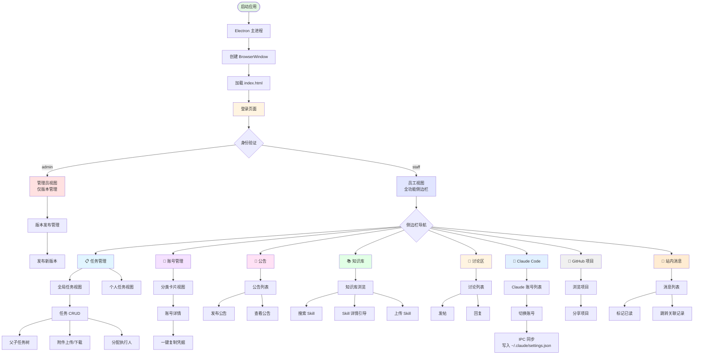
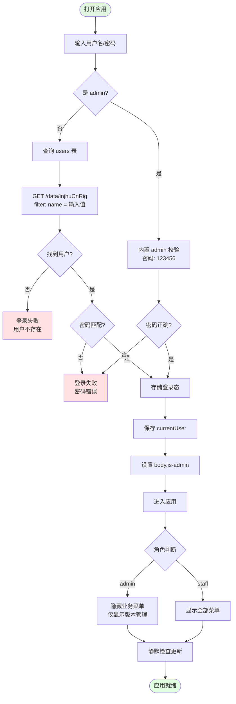
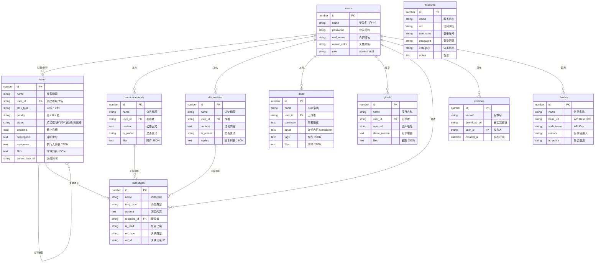
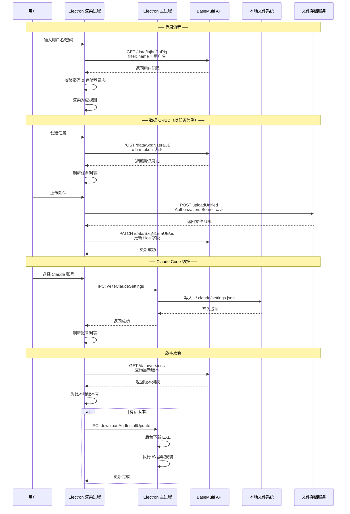
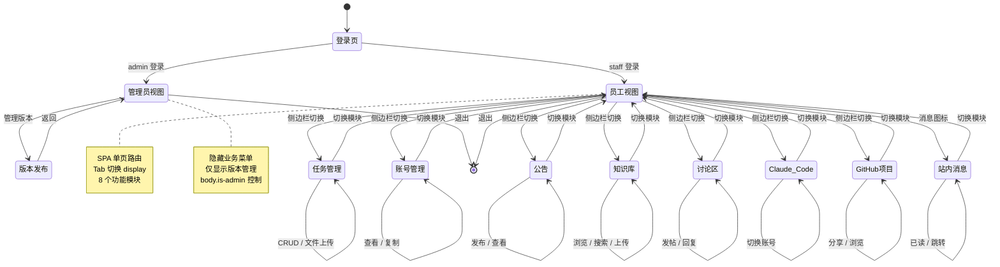
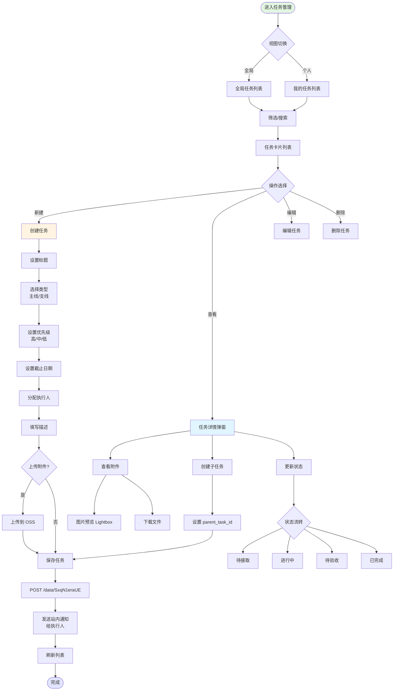
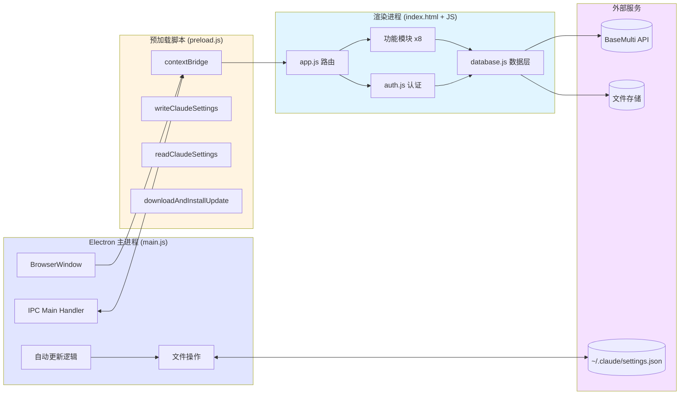

# 码码乐内部协作管理平台 — 工作流程图

## 主流程图

```mermaid
flowchart TD
    Start([启动应用]) --> Electron[Electron 主进程]
    Electron --> CreateWindow[创建 BrowserWindow]
    CreateWindow --> LoadHTML[加载 index.html]
    LoadHTML --> Login[登录页面]

    Login --> AuthCheck{身份验证}
    AuthCheck --> |admin| AdminView[管理员视图<br/>仅版本管理]
    AuthCheck --> |staff| StaffView[员工视图<br/>全功能侧边栏]

    AdminView --> VersionMgmt[版本发布管理]
    VersionMgmt --> PublishVer[发布新版本]

    StaffView --> Nav{侧边栏导航}

    Nav --> Tasks[📋 任务管理]
    Nav --> Accounts[🔑 账号管理]
    Nav --> Announcements[📢 公告]
    Nav --> Skills[📚 知识库]
    Nav --> Discussions[💬 讨论区]
    Nav --> ClaudeCode[🤖 Claude Code]
    Nav --> GitHub[🐙 GitHub 项目]
    Nav --> Messages[📩 站内消息]

    Tasks --> TaskGlobal[全局任务视图]
    Tasks --> TaskPersonal[个人任务视图]
    TaskGlobal --> TaskCRUD[任务 CRUD]
    TaskCRUD --> TaskTree[父子任务树]
    TaskCRUD --> FileUpload[附件上传/下载]
    TaskCRUD --> AssignUser[分配执行人]

    Accounts --> AccCategory[分类卡片视图]
    AccCategory --> AccDetail[账号详情]
    AccDetail --> CopyCredential[一键复制凭据]

    Announcements --> AnnList[公告列表]
    AnnList --> AnnPublish[发布公告]
    AnnList --> AnnView[查看公告]

    Skills --> SkillStore[知识库浏览]
    SkillStore --> SkillSearch[搜索 Skill]
    SkillStore --> SkillGuide[Skill 详情引导]
    SkillStore --> SkillUpload[上传 Skill]

    Discussions --> DiscList[讨论列表]
    DiscList --> DiscPost[发帖]
    DiscList --> DiscReply[回复]

    ClaudeCode --> CCList[Claude 账号列表]
    CCList --> CCSwitch[切换账号]
    CCSwitch --> CCSync[IPC 同步<br/>写入 ~/.claude/settings.json]

    GitHub --> GHBrowse[浏览项目]
    GHBrowse --> GHShare[分享项目]

    Messages --> MsgList[消息列表]
    MsgList --> MsgRead[标记已读]
    MsgList --> MsgJump[跳转关联记录]

    style Start fill:#e1f5e1
    style Login fill:#fff4e1
    style AdminView fill:#ffe1e1
    style StaffView fill:#e1e5ff
    style Tasks fill:#e1f5ff
    style Accounts fill:#f5e1ff
    style Announcements fill:#ffe1f5
    style Skills fill:#e1ffe5
    style Discussions fill:#fff4e1
    style ClaudeCode fill:#e1f0ff
    style GitHub fill:#f0f0f0
    style Messages fill:#ffecd2
```

## 登录认证详细流程

```mermaid
flowchart TD
    Start([打开应用]) --> InputCred[输入用户名/密码]
    InputCred --> IsAdmin{是 admin?}

    IsAdmin --> |是| AdminLogin[内置 admin 校验<br/>密码: 123456]
    IsAdmin --> |否| DBQuery[查询 users 表]

    DBQuery --> QueryAPI[GET /data/injhuCnRig<br/>filter: name = 输入值]
    QueryAPI --> Found{找到用户?}

    Found --> |否| LoginFail[登录失败<br/>用户不存在]
    Found --> |是| CheckPwd{密码匹配?}

    CheckPwd --> |否| PwdFail[登录失败<br/>密码错误]
    CheckPwd --> |是| SetSession[存储登录态]

    AdminLogin --> CheckAdminPwd{密码正确?}
    CheckAdminPwd --> |否| PwdFail
    CheckAdminPwd --> |是| SetSession

    SetSession --> SaveUser[保存 currentUser]
    SaveUser --> SetBodyClass[设置 body.is-admin]
    SetBodyClass --> EnterApp[进入应用]

    EnterApp --> CheckRole{角色判断}
    CheckRole --> |admin| HideSidebar[隐藏业务菜单<br/>仅显示版本管理]
    CheckRole --> |staff| ShowAll[显示全部菜单]

    HideSidebar --> CheckUpdate[静默检查更新]
    ShowAll --> CheckUpdate
    CheckUpdate --> Ready([应用就绪])

    style Start fill:#e1f5e1
    style Ready fill:#e1ffe1
    style LoginFail fill:#ffe1e1
    style PwdFail fill:#ffe1e1
```

## 数据库表关系图

```mermaid
erDiagram
    users ||--o{ tasks : "创建/执行"
    users ||--o{ announcements : "发布"
    users ||--o{ discussions : "发帖"
    users ||--o{ skills : "上传"
    users ||--o{ github : "分享"
    users ||--o{ messages : "接收"
    users ||--o{ versions : "发布"
    users ||--o{ claudes : "使用"
    tasks ||--o{ tasks : "父子嵌套"
    tasks ||--o{ messages : "关联通知"
    announcements ||--o{ messages : "关联通知"
    discussions ||--o{ messages : "关联通知"

    users {
        number id PK
        string name "登录名（唯一）"
        string password "登录密码"
        string real_name "真实姓名"
        string avatar_color "头像颜色"
        string role "admin / staff"
    }

    tasks {
        number id PK
        string name "任务标题"
        string user_id FK "创建者用户名"
        string task_type "主线 / 支线"
        string priority "高 / 中 / 低"
        string status "待接取/进行中/待验收/已完成"
        date deadline "截止日期"
        text description "详细需求"
        text assignees "执行人列表 JSON"
        text files "附件列表 JSON"
        string parent_task_id "父任务 ID"
    }

    accounts {
        number id PK
        string name "服务名称"
        string url "访问网址"
        string username "登录账号"
        string password "登录密码"
        string category "分类名称"
        text notes "备注"
    }

    announcements {
        number id PK
        string name "公告标题"
        string user_id FK "发布者"
        text content "公告正文"
        string is_pinned "是否置顶"
        text files "附件 JSON"
    }

    discussions {
        number id PK
        string name "讨论标题"
        string user_id FK "作者"
        text content "讨论内容"
        string is_pinned "是否置顶"
        text replies "回复列表 JSON"
    }

    skills {
        number id PK
        string name "Skill 名称"
        string user_id FK "上传者"
        text summary "简要描述"
        text detail "详细内容 Markdown"
        text tags "标签 JSON"
        text files "附件 JSON"
    }

    github {
        number id PK
        string name "项目名称"
        string user_id FK "分享者"
        string repo_url "仓库地址"
        text share_reason "分享理由"
        text files "截图 JSON"
    }

    claudes {
        number id PK
        string name "账号名称"
        string base_url "API Base URL"
        string auth_token "API Key"
        string remark "当前使用人"
        string is_active "是否启用"
    }

    messages {
        number id PK
        string name "消息标题"
        string msg_type "消息类型"
        text content "消息内容"
        string recipient_id FK "接收者"
        string is_read "是否已读"
        string ref_type "关联类型"
        string ref_id "关联记录 ID"
    }

    versions {
        number id PK
        string version "版本号"
        string download_url "安装包直链"
        string user_id FK "发布人"
        datetime created_at "发布时间"
    }
```

## API 调用时序图

```mermaid
sequenceDiagram
    participant U as 用户
    participant E as Electron 渲染进程
    participant M as Electron 主进程
    participant API as BaseMulti API
    participant FS as 本地文件系统
    participant OSS as 文件存储服务

    Note over U,OSS: ── 登录流程 ──

    U->>E: 输入用户名/密码
    E->>API: GET /data/injhuCnRig<br/>filter: name = 用户名
    API-->>E: 返回用户记录
    E->>E: 校验密码 & 存储登录态
    E->>E: 渲染对应视图

    Note over U,OSS: ── 数据 CRUD（以任务为例）──

    U->>E: 创建任务
    E->>API: POST /data/SxqN1eraUE<br/>x-bm-token 认证
    API-->>E: 返回新记录 ID
    E->>E: 刷新任务列表

    U->>E: 上传附件
    E->>OSS: POST uploadUnified<br/>Authorization: Bearer 认证
    OSS-->>E: 返回文件 URL
    E->>API: PATCH /data/SxqN1eraUE/:id<br/>更新 files 字段
    API-->>E: 更新成功

    Note over U,OSS: ── Claude Code 切换 ──

    U->>E: 选择 Claude 账号
    E->>M: IPC: writeClaudeSettings
    M->>FS: 写入 ~/.claude/settings.json
    FS-->>M: 写入成功
    M-->>E: 返回成功
    E->>E: 刷新账号列表

    Note over U,OSS: ── 版本更新 ──

    E->>API: GET /data/versions<br/>查询最新版本
    API-->>E: 返回版本列表
    E->>E: 对比本地版本号

    alt 有新版本
        E->>M: IPC: downloadAndInstallUpdate
        M->>M: 后台下载 EXE
        M->>M: 执行 /S 静默安装
        M-->>E: 更新完成
    end
```

## 状态机图

```mermaid
stateDiagram-v2
    [*] --> 登录页

    登录页 --> 管理员视图: admin 登录
    登录页 --> 员工视图: staff 登录

    管理员视图 --> 版本发布: 管理版本
    版本发布 --> 管理员视图: 返回

    员工视图 --> 任务管理: 侧边栏切换
    员工视图 --> 账号管理: 侧边栏切换
    员工视图 --> 公告: 侧边栏切换
    员工视图 --> 知识库: 侧边栏切换
    员工视图 --> 讨论区: 侧边栏切换
    员工视图 --> Claude_Code: 侧边栏切换
    员工视图 --> GitHub项目: 侧边栏切换
    员工视图 --> 站内消息: 消息图标

    任务管理 --> 任务管理: CRUD / 文件上传
    账号管理 --> 账号管理: 查看 / 复制
    公告 --> 公告: 发布 / 查看
    知识库 --> 知识库: 浏览 / 搜索 / 上传
    讨论区 --> 讨论区: 发帖 / 回复
    Claude_Code --> Claude_Code: 切换账号
    GitHub项目 --> GitHub项目: 分享 / 浏览
    站内消息 --> 站内消息: 已读 / 跳转

    任务管理 --> 员工视图: 切换模块
    账号管理 --> 员工视图: 切换模块
    公告 --> 员工视图: 切换模块
    知识库 --> 员工视图: 切换模块
    讨论区 --> 员工视图: 切换模块
    Claude_Code --> 员工视图: 切换模块
    GitHub项目 --> 员工视图: 切换模块
    站内消息 --> 员工视图: 切换模块

    管理员视图 --> [*]: 退出
    员工视图 --> [*]: 退出

    note right of 员工视图
        SPA 单页路由
        Tab 切换 display
        8 个功能模块
    end note

    note right of 管理员视图
        隐藏业务菜单
        仅显示版本管理
        body.is-admin 控制
    end note
```

## 任务管理详细流程

```mermaid
flowchart TD
    Start([进入任务管理]) --> ViewSwitch{视图切换}

    ViewSwitch --> |全局| GlobalView[全局任务列表]
    ViewSwitch --> |个人| PersonalView[我的任务列表]

    GlobalView --> Filter[筛选/搜索]
    PersonalView --> Filter

    Filter --> TaskList[任务卡片列表]
    TaskList --> SelectTask{操作选择}

    SelectTask --> |新建| CreateTask[创建任务]
    SelectTask --> |查看| TaskDetail[任务详情弹窗]
    SelectTask --> |编辑| EditTask[编辑任务]
    SelectTask --> |删除| DeleteTask[删除任务]

    CreateTask --> SetTitle[设置标题]
    SetTitle --> SetType[选择类型<br/>主线/支线]
    SetType --> SetPriority[设置优先级<br/>高/中/低]
    SetPriority --> SetDeadline[设置截止日期]
    SetDeadline --> SetAssignees[分配执行人]
    SetAssignees --> SetDesc[填写描述]
    SetDesc --> UploadFiles{上传附件?}

    UploadFiles --> |是| Upload[上传到 OSS]
    UploadFiles --> |否| SaveTask[保存任务]
    Upload --> SaveTask

    SaveTask --> PostAPI[POST /data/SxqN1eraUE]
    PostAPI --> SendNotify[发送站内通知<br/>给执行人]
    SendNotify --> RefreshList[刷新列表]

    TaskDetail --> ViewFiles[查看附件]
    ViewFiles --> PreviewImg[图片预览 Lightbox]
    ViewFiles --> DownloadFile[下载文件]

    TaskDetail --> CreateSubTask[创建子任务]
    CreateSubTask --> SetParentId[设置 parent_task_id]
    SetParentId --> SaveTask

    TaskDetail --> UpdateStatus[更新状态]
    UpdateStatus --> StatusFlow{状态流转}
    StatusFlow --> S1[待接取]
    StatusFlow --> S2[进行中]
    StatusFlow --> S3[待验收]
    StatusFlow --> S4[已完成]

    RefreshList --> End([完成])

    style Start fill:#e1f5e1
    style End fill:#e1e5ff
    style CreateTask fill:#fff4e1
    style TaskDetail fill:#e1f5ff
```

## Electron 架构图

```mermaid
flowchart LR
    subgraph Main["Electron 主进程 (main.js)"]
        MW[BrowserWindow]
        IPC_Main[IPC Main Handler]
        AutoUpdate[自动更新逻辑]
        FileOps[文件操作]
    end

    subgraph Preload["预加载脚本 (preload.js)"]
        Bridge[contextBridge]
        API_Write[writeClaudeSettings]
        API_Read[readClaudeSettings]
        API_Update[downloadAndInstallUpdate]
    end

    subgraph Renderer["渲染进程 (index.html + JS)"]
        App[app.js 路由]
        Auth[auth.js 认证]
        DB[database.js 数据层]
        Modules[功能模块 x8]
    end

    subgraph External["外部服务"]
        BM[(BaseMulti API)]
        OSS_Ext[(文件存储)]
        Claude[(~/.claude/settings.json)]
    end

    MW --> Bridge
    Bridge --> App
    IPC_Main <--> Bridge
    FileOps <--> Claude
    AutoUpdate --> FileOps

    DB --> BM
    DB --> OSS_Ext
    Modules --> DB
    Auth --> DB
    App --> Modules
    App --> Auth

    style Main fill:#e1e5ff
    style Preload fill:#fff4e1
    style Renderer fill:#e1f5ff
    style External fill:#f5e1ff
```

---

*最后更新：2026-03-03*
