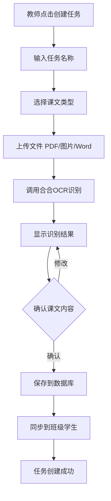
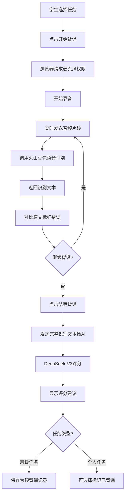
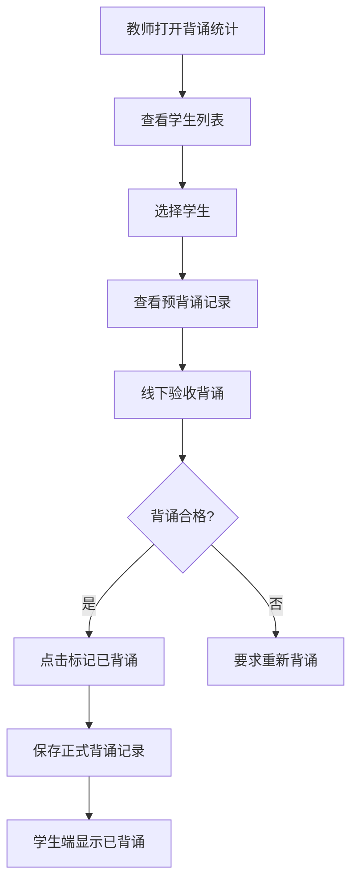

# 班级背诵表 - 实施方案

**项目名称**：班级背诵表
**创建时间**：2026-01-12
**配色方案**：天空渐变系（专业简洁风格）
**技术栈**：HTML/CSS/JavaScript + BaseMulti数据库 + 外接AI服务

---

## 一、需求确认

### 1.1 项目概述

班级背诵表是一个基于语音识别和AI评分的背诵辅助系统，帮助教师管理班级背诵任务，帮助学生进行背诵练习和自我评估。

### 1.2 核心功能

#### 教师端功能
1. **任务管理**
   - 创建班级背诵任务（导入课文内容）
   - 支持古诗词、语文课文、英语课文
   - 通过OCR识别导入课文（支持PDF/图片/Word）

2. **背诵记录管理**
   - 查看学生背诵情况统计
   - 标记学生已背诵（线下验收后）
   - 查看AI评分建议

3. **统计分析**
   - 查看班级整体背诵进度
   - 查看个人背诵完成情况
   - 导出背诵记录

#### 学生端功能
1. **任务查看**
   - 查看未背诵任务列表（班级任务+个人任务）
   - 查看已背诵任务列表（标记任务类型）
   - 任务详情查看（课文内容、创建时间等）

2. **背诵练习**
   - 点击"开始背诵"进行录音
   - 实时语音识别
   - 实时对比原文，错误字标红显示
   - 点击"结束背诵"获取AI评分

3. **个人任务管理**
   - 创建个人背诵任务（导入课文）
   - 自行标记完成
   - 查看AI评分反馈

### 1.3 关键业务规则

1. **任务分类**
   - 班级任务：由教师创建，全班学生可见
   - 个人任务：由学生创建，仅自己可见

2. **完成标记**
   - 班级任务：只能由教师标记已背诵（需线下验收）
   - 个人任务：学生可自行标记已背诵

3. **预背诵练习**
   - 学生可对班级任务进行预背诵练习
   - 预背诵有AI评分，但不计入正式背诵记录
   - 只有教师标记才算正式完成

4. **权限控制**
   - 通过URL参数`teachertoken`判断用户模式
   - 有`teachertoken`=教师模式，否则=学生模式

---

## 二、功能设计

### 2.1 教师端页面结构

```
教师端主页
├── 顶部导航
│   ├── 班级选择器
│   ├── 页面切换（任务管理/背诵统计）
│   └── 用户信息
├── 任务管理页面
│   ├── 创建任务按钮
│   ├── 任务列表（可编辑/删除）
│   └── 任务详情（课文内容、创建时间、背诵人数）
├── 背诵统计页面
│   ├── 统计图表（整体进度、完成率）
│   ├── 学生列表（背诵情况）
│   └── 操作按钮（标记已背诵、查看详情）
└── 创建任务弹窗
    ├── 任务名称
    ├── 课文类型（古诗词/语文课文/英语课文）
    ├── 导入方式（OCR识别）
    └── 课文内容预览
```

### 2.2 学生端页面结构

```
学生端主页
├── 顶部导航
│   ├── 页面切换（未背诵/已背诵/个人任务）
│   └── 用户信息
├── 未背诵列表页面
│   ├── 筛选器（全部/班级/个人）
│   ├── 任务卡片
│   │   ├── 任务名称
│   │   ├── 课文类型
│   │   ├── 任务标签（班级/个人）
│   │   └── 操作按钮（开始背诵/预背诵）
│   └── 创建个人任务按钮
├── 已背诵列表页面
│   ├── 任务卡片
│   │   ├── 任务名称
│   │   ├── 完成时间
│   │   ├── AI评分
│   │   └── 任务标签（班级/个人）
│   └── 查看详情
├── 背诵页面
│   ├── 课文显示区（实时对比标红）
│   ├── 录音控制（开始/结束）
│   ├── 识别文本显示
│   └── AI评分显示
└── 创建个人任务弹窗
    ├── 任务名称
    ├── 课文类型
    ├── 导入方式（OCR识别）
    └── 课文内容预览
```

### 2.3 核心流程设计

#### 流程1：教师创建班级任务



#### 流程2：学生背诵练习



#### 流程3：教师标记已背诵



---

## 三、技术架构

### 3.1 前端技术栈

- **HTML5**：页面结构
- **CSS3**：样式布局（天空渐变系配色）
- **原生JavaScript**：业务逻辑、API调用
- **Web Audio API**：浏览器录音
- **EventSource**：SSE流式接收AI响应

### 3.2 后端服务

- **BaseMulti数据库**：数据存储
- **合合OCR**：课文识别
- **火山豆包**：语音识别
- **DeepSeek-V3**：AI评分

### 3.3 数据流转

```
前端 <---> BaseMulti数据库 (任务、记录存储)
前端 <---> 合合OCR API (课文导入)
前端 <---> 火山豆包 API (语音识别)
前端 <---> DeepSeek-V3 API (AI评分)
前端 <---> mamale.vip API (学生、班级信息)
```

### 3.4 实时语音识别方案

#### 方案选择：WebSocket流式传输 + 火山豆包极速版

**技术实现**：

1. 使用`MediaRecorder` API录音
2. 每500ms切分一个音频片段
3. 将音频片段转为base64发送给API
4. API返回识别文本
5. 前端实时对比并标红

**代码示例**：
```javascript
// 录音配置
const mediaRecorder = new MediaRecorder(stream, {
    mimeType: 'audio/webm'
});

// 每500ms切片
const chunks = [];
mediaRecorder.ondataavailable = async (e) => {
    if (e.data.size > 0) {
        const audioBlob = e.data;
        const base64 = await blobToBase64(audioBlob);

        // 调用语音识别
        const result = await fetch('api/app/volcengine/audioToTextMy', {
            method: 'POST',
            headers: { 'Authorization': `Bearer ${token}` },
            body: JSON.stringify({ content: base64 })
        });

        const text = await result.json();
        compareAndHighlight(text.content);
    }
};

// 启动录音
mediaRecorder.start(500); // 每500ms触发一次
```

---

## 四、数据库设计概览

详细设计见《02-数据库表设计.md》

### 4.1 核心数据表

1. **recitation_tasks（背诵任务表）**
   - 存储班级任务和个人任务
   - 包含课文内容、类型、创建者等

2. **recitation_records（背诵记录表）**
   - 存储学生的背诵记录
   - 区分预背诵和正式背诵
   - 记录AI评分和识别文本

3. **students（学生信息缓存表）**
   - 缓存mamale.vip API的学生数据
   - 减少API调用次数

4. **classes（班级信息缓存表）**
   - 缓存班级数据
   - 关联学生和任务

---

## 五、UI设计规范

### 5.1 配色方案：天空渐变系

根据`.claude/skills/配色/SKILL.md`的天空渐变系方案：

```css
/* 背景色 */
--bg-main: #021024;         /* 深蓝黑（暗色模式） */
--bg-light: #C1E8FF;        /* 浅天蓝（亮色模式） */

/* 主色调 */
--primary: #7DA0CA;         /* 天蓝（主按钮、强调） */
--primary-light: #C1E8FF;   /* 浅天蓝（高光） */
--primary-dark: #05B6D9;    /* 深蓝（背景渐变起点） */

/* 容器 */
--container-bg: #849DB1;    /* 雾蓝（卡片/容器） */

/* 文字 */
--text-primary: #021024;    /* 深蓝黑（主标题） */
--text-secondary: #849DB1;  /* 雾蓝（次要文字） */

/* 渐变组合 */
--gradient-bg: linear-gradient(135deg, #7DA0CA 0%, #C1E8FF 100%);
--gradient-card: linear-gradient(135deg, #849DB1 0%, #C1E8FF 100%);
```

### 5.2 组件风格

参考`.claude/skills/UI设计/SKILL.md`：

- **玻璃拟态效果**：半透明背景 + 模糊 + 柔和阴影
- **平滑动画**：过渡时间0.3s
- **圆角设计**：12px-16px
- **专业字体**：微软雅黑、苹方、思源黑体

### 5.3 特殊效果

#### 实时对比标红
```css
.text-correct {
    color: #7DA0CA; /* 天蓝色 */
}

.text-error {
    color: #FF6B6B; /* 红色 */
    background: rgba(255, 107, 107, 0.1);
    font-weight: bold;
}
```


### 6.2 技术难点与解决方案

#### 难点1：实时语音识别延迟

**问题**：音频切片过小导致识别不准，切片过大导致延迟高

**解决方案**：

- 使用500ms切片（平衡准确度和实时性）
- 客户端缓存最近3次识别结果，平滑拼接
- 显示"识别中..."加载状态

#### 难点2：文字对比算法

**问题**：识别文本可能有多字、少字、错字

**解决方案**：
- 使用Levenshtein距离算法（编辑距离）
- 实现字符级对比，标记增删改
- 提供容错率设置（允许X%错误）

#### 难点3：浏览器兼容性

**问题**：`MediaRecorder`在部分浏览器不支持

**解决方案**：
- 优先支持Chrome/Edge（占比>80%）
- 降级方案：提示用户使用推荐浏览器
- 使用`navigator.mediaDevices.getUserMedia`检测支持情况

---

## 七、性能优化策略

### 7.1 缓存策略

根据CLAUDE.md的经验教训：

1. **学生列表缓存**
   - 缓存时间：10分钟
   - 缓存失效：数据变更时清除
   - 存储位置：`APP_STATE.cachedStudents`

2. **任务列表缓存**
   - 教师端：创建/编辑/删除后刷新
   - 学生端：进入页面加载，10分钟有效

3. **班级信息缓存**
   - localStorage备份（7天过期）
   - 优先从缓存加载，后台异步同步

### 7.2 API调用优化

1. **并行请求**
   - 使用`Promise.all`同时请求学生列表+任务列表
   - 减少串行等待时间

2. **分页加载**
   - 任务列表超过20条时分页显示
   - 懒加载历史背诵记录

3. **防抖节流**
   - 搜索框输入使用防抖（300ms）
   - 滚动加载使用节流（200ms）

---

## 八、安全与容错

### 8.1 权限控制

1. **URL参数验证**
   - 检查`teachertoken`的有效性
   - 无效token拒绝访问

2. **数据隔离**
   - 学生只能看到自己的任务和记录
   - 教师只能看到本班级数据

### 8.2 容错设计

1. **API调用失败**
   - 显示友好错误提示
   - 提供重试按钮
   - 记录错误日志

2. **语音识别失败**
   - 提示检查麦克风权限
   - 提供手动输入备用方案
   - 保存已识别的部分内容

3. **数据同步失败**
   - 本地存储临时数据
   - 网络恢复后自动重试
   - 提示用户数据未同步

---

## 九、后续扩展

### 9.1 可选功能

1. **语音评测**
   - 发音准确度评分
   - 语速评估
   - 停顿分析

2. **学习分析**
   - 个人背诵曲线
   - 易错字统计
   - 学习时长统计

3. **社交功能**
   - 班级排行榜
   - 背诵打卡
   - 成就徽章

### 9.2 技术升级

1. **离线模式**
   - Service Worker缓存资源
   - IndexedDB存储数据
   - 离线背诵练习

2. **移动端适配**
   - 响应式设计
   - 触摸手势优化
   - PWA封装

---

## 十、交付物清单

### 10.1 开发文档

- [x] 01-实施方案.md（本文档）
- [ ] 02-数据库表设计.md
- [ ] 03-配置说明.md

### 10.2 代码文件

- [ ] index.html（教师端主页）
- [ ] student.html（学生端主页）
- [ ] css/style.css（样式文件）
- [ ] js/app.js（主逻辑）
- [ ] js/database.js（数据库操作）
- [ ] js/recorder.js（录音功能）
- [ ] js/recognizer.js（语音识别）
- [ ] js/ai-scorer.js（AI评分）
- [ ] js/ocr.js（OCR导入）

### 10.3 测试文档

- [ ] 功能测试报告
- [ ] 性能测试报告
- [ ] 用户手册

---

## 十一、项目里程碑

| 阶段 | 时间节点 | 交付物 | 状态 |
|------|---------|--------|------|
| 需求讨论 | 2026-01-12 | 需求确认文档 | ✅ 已完成 |
| 方案规划 | 2026-01-12 | 实施方案+数据库设计 | 🔄 进行中 |
| 领导审核 | 待定 | 审核通过 | ⏳ 待审核 |
| 代码实现 | 待定 | 完整项目代码 | ⏳ 待开始 |
| 测试上线 | 待定 | 测试报告+上线部署 | ⏳ 待开始 |

---

**文档版本**：v1.0
