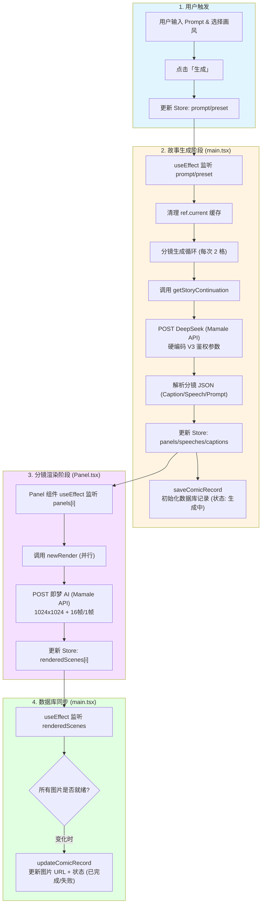

# AI Comic Factory 核心逻辑详解

本项目基于 Next.js + React + Zustand 构建，采用 **“两阶段生成”** 模式：先生成分镜文本，再并行渲染分镜图片。

## 1. 核心状态流转 (Zustand)

状态存储在 `src/app/store/index.ts` 中，主要包含：

- `prompt`: 用户输入的故事描述。
- `panels`: 分镜提示词数组（由 LLM 生成）。
- `speeches / captions`: 旁白与对话数组。
- `renderedScenes`: 已渲染的场景数据（包含图片 URL）。

## 2. 详细执行流程图

## 3. 关键组件与模块职责

### 3.1 `src/app/main.tsx` (总策化)

- **监听器**：监控全局状态变化。
- **调度中心**：负责 LLM 故事生成的串行逻辑（为了保持故事连贯性，分镜是 2 格一组按顺序生成的）。
- **同步器**：负责将最新的渲染结果同步回数据库。

### 3.2 `src/app/interface/panel/index.tsx` (执行单元)

- **并行渲染**：每个独立的 `Panel` 组件负责自己的图片生成请求。
- **局部重绘**：通过 `handleReload` 提供单格重试/修改提示词的功能。
- **气泡合成**：利用 `injectSpeechBubbleInTheBackground` 在前端合成对话气泡。

### 3.3 `src/app/engine/render.ts` (基础引擎)

- **底层封装**：直接对接 `mamale.vip` 的生图 API。
- **硬编码鉴权**：集成了最新的 **V3 鉴权体系**，确保请求能通过网关。

### 3.4 `src/app/queries/saveComicRecord.ts` (数据持久化)

- **状态同步**：将漫画的完整生命周期（生成中 -> 已完成/失败）同步到 BaseMulti 数据库。

## 4. 异常处理机制

- **LLM 熔断**：如果一页分镜生成失败，会停止后续页面的生成，防止 Token 浪费。
- **图片重试**：单格图片渲染失败时，`Panel.tsx` 内部会自动尝试再次请求。
- **存储补丁**：`main.tsx` 在启动时会检查并清理 `V1/V2` 旧版本 Token，强制应用最新的 **V3 硬编码配置**。
