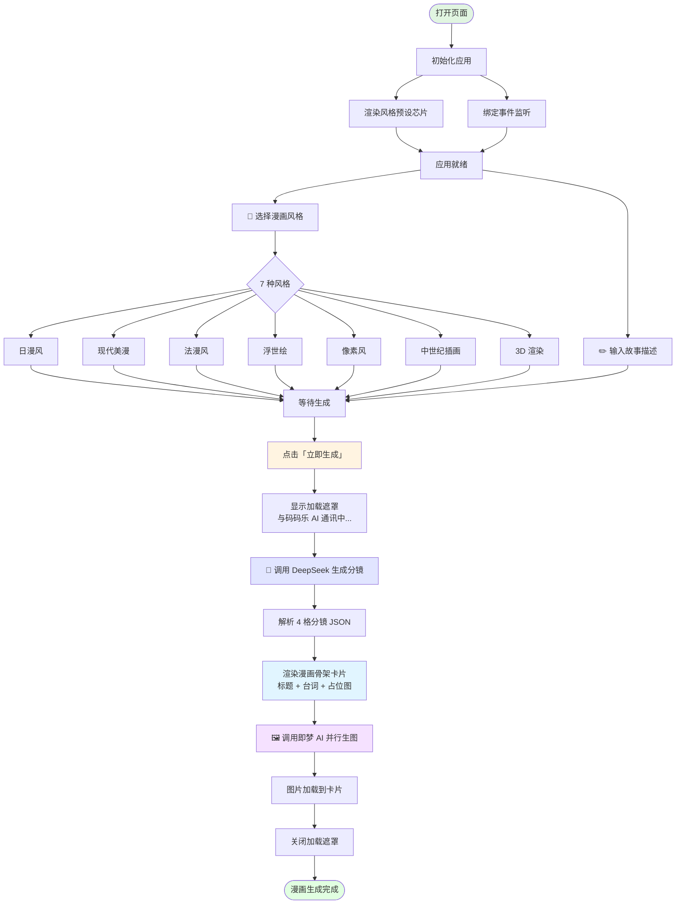
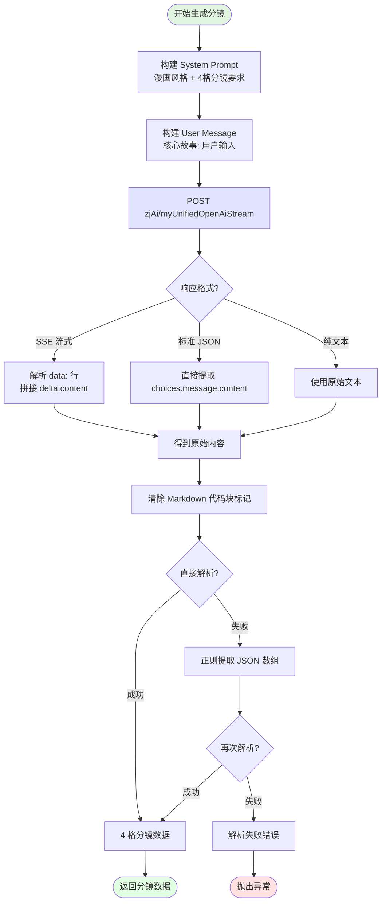
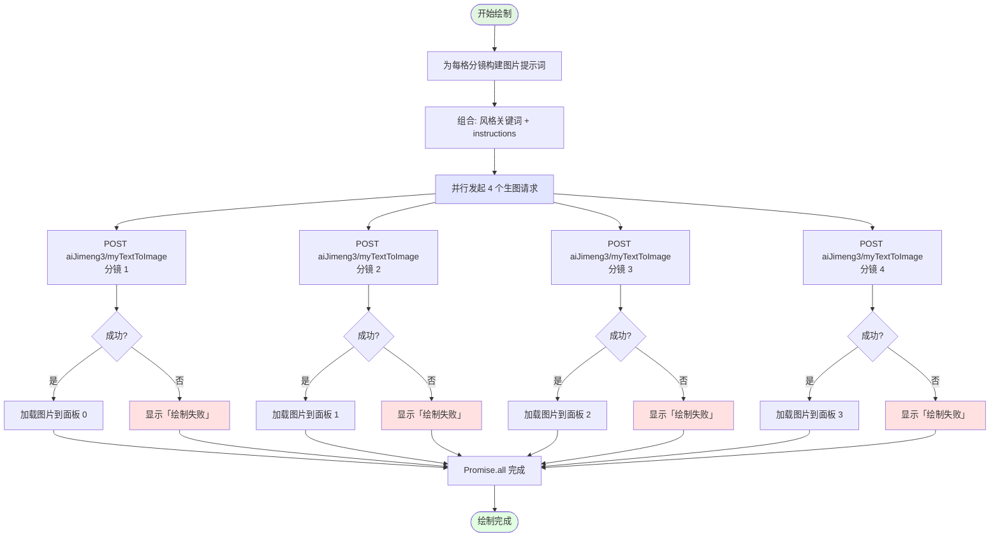
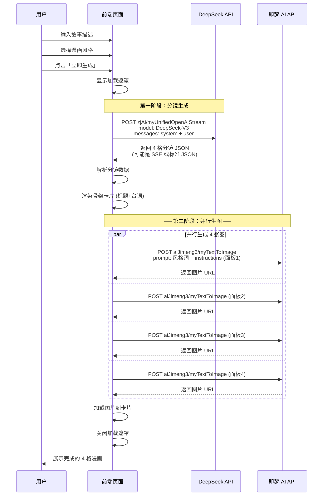
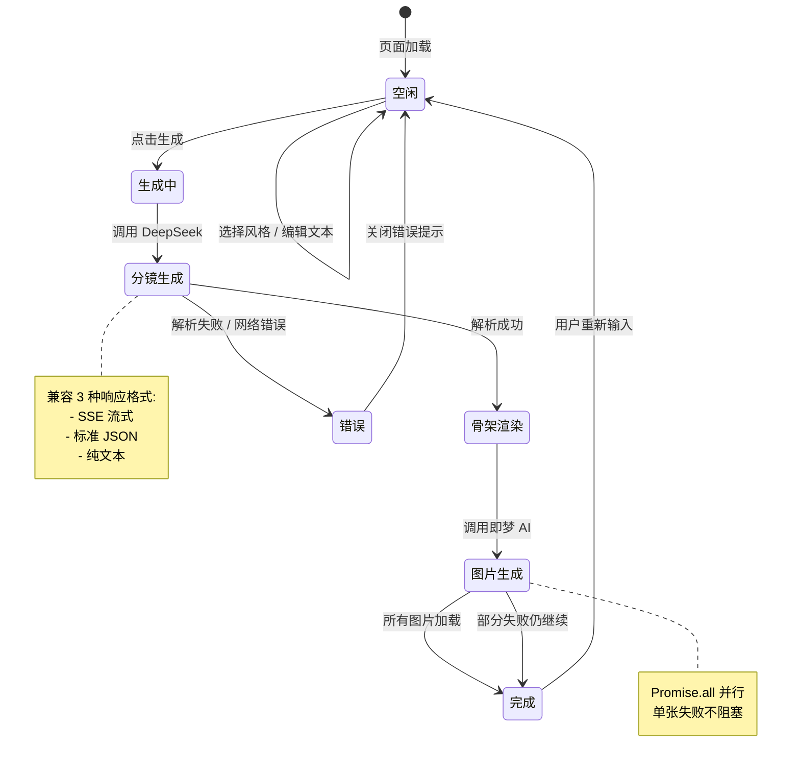
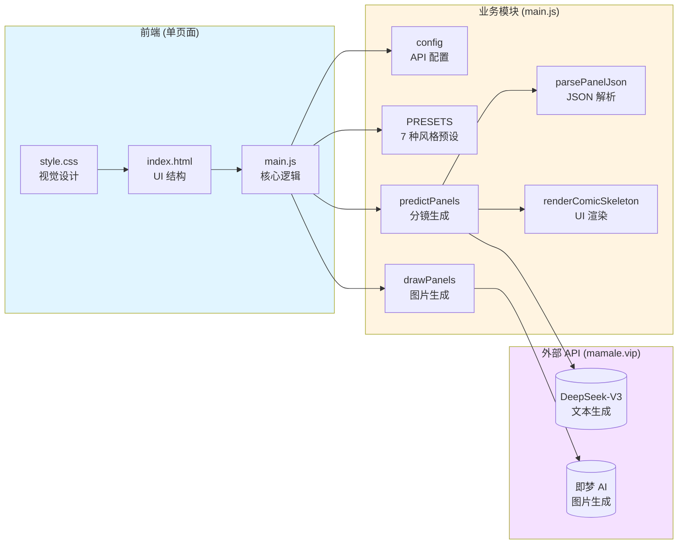

# AI 漫画生成器 — 工作流程图

## 主流程图

```mermaid
flowchart TD
    Start([打开页面]) --> Init[初始化应用]
    Init --> RenderPresets[渲染风格预设芯片]
    Init --> BindEvents[绑定事件监听]
    RenderPresets --> Ready[应用就绪]
    BindEvents --> Ready

    Ready --> SelectStyle[🎨 选择漫画风格]
    Ready --> InputPrompt[✏️ 输入故事描述]

    SelectStyle --> StyleList{7 种风格}
    StyleList --> S1[日漫风]
    StyleList --> S2[现代美漫]
    StyleList --> S3[法漫风]
    StyleList --> S4[浮世绘]
    StyleList --> S5[像素风]
    StyleList --> S6[中世纪插画]
    StyleList --> S7[3D 渲染]

    S1 --> WaitGenerate[等待生成]
    S2 --> WaitGenerate
    S3 --> WaitGenerate
    S4 --> WaitGenerate
    S5 --> WaitGenerate
    S6 --> WaitGenerate
    S7 --> WaitGenerate

    InputPrompt --> WaitGenerate
    WaitGenerate --> ClickGenerate[点击「立即生成」]

    ClickGenerate --> ShowLoading[显示加载遮罩<br/>与码码乐 AI 通讯中...]
    ShowLoading --> PredictPanels[📝 调用 DeepSeek 生成分镜]
    PredictPanels --> ParseJSON[解析 4 格分镜 JSON]
    ParseJSON --> RenderSkeleton[渲染漫画骨架卡片<br/>标题 + 台词 + 占位图]

    RenderSkeleton --> DrawPanels[🖼️ 调用即梦 AI 并行生图]
    DrawPanels --> FillImages[图片加载到卡片]
    FillImages --> HideLoading[关闭加载遮罩]
    HideLoading --> Done([漫画生成完成])

    style Start fill:#e1f5e1
    style Done fill:#e1ffe1
    style ClickGenerate fill:#fff4e1
    style PredictPanels fill:#e1e5ff
    style DrawPanels fill:#f5e1ff
    style RenderSkeleton fill:#e1f5ff
```

## DeepSeek 分镜生成详细流程

```mermaid
flowchart TD
    Start([开始生成分镜]) --> BuildPrompt[构建 System Prompt<br/>漫画风格 + 4格分镜要求]
    BuildPrompt --> UserMsg[构建 User Message<br/>核心故事: 用户输入]

    UserMsg --> CallAPI[POST zjAi/myUnifiedOpenAiStream]
    CallAPI --> CheckResp{响应格式?}

    CheckResp --> |SSE 流式| ParseSSE[解析 data: 行<br/>拼接 delta.content]
    CheckResp --> |标准 JSON| ParseDirect[直接提取 choices.message.content]
    CheckResp --> |纯文本| UseRaw[使用原始文本]

    ParseSSE --> RawContent[得到原始内容]
    ParseDirect --> RawContent
    UseRaw --> RawContent

    RawContent --> CleanJSON[清除 Markdown 代码块标记]
    CleanJSON --> TryParse{直接解析?}

    TryParse --> |成功| Panels[4 格分镜数据]
    TryParse --> |失败| RegexMatch[正则提取 JSON 数组]
    RegexMatch --> TryParse2{再次解析?}
    TryParse2 --> |成功| Panels
    TryParse2 --> |失败| Error[解析失败错误]

    Panels --> End([返回分镜数据])
    Error --> ErrorEnd([抛出异常])

    style Start fill:#e1f5e1
    style End fill:#e1ffe1
    style ErrorEnd fill:#ffe1e1
    style CallAPI fill:#e1e5ff
```

## 即梦 AI 图片生成详细流程

```mermaid
flowchart TD
    Start([开始绘制]) --> BuildPrompts[为每格分镜构建图片提示词]
    BuildPrompts --> Combine[组合: 风格关键词 + instructions]

    Combine --> Parallel[并行发起 4 个生图请求]

    Parallel --> Task1[POST aiJimeng3/myTextToImage<br/>分镜 1]
    Parallel --> Task2[POST aiJimeng3/myTextToImage<br/>分镜 2]
    Parallel --> Task3[POST aiJimeng3/myTextToImage<br/>分镜 3]
    Parallel --> Task4[POST aiJimeng3/myTextToImage<br/>分镜 4]

    Task1 --> Check1{成功?}
    Task2 --> Check2{成功?}
    Task3 --> Check3{成功?}
    Task4 --> Check4{成功?}

    Check1 --> |是| Load1[加载图片到面板 0]
    Check1 --> |否| Fail1[显示「绘制失败」]
    Check2 --> |是| Load2[加载图片到面板 1]
    Check2 --> |否| Fail2[显示「绘制失败」]
    Check3 --> |是| Load3[加载图片到面板 2]
    Check3 --> |否| Fail3[显示「绘制失败」]
    Check4 --> |是| Load4[加载图片到面板 3]
    Check4 --> |否| Fail4[显示「绘制失败」]

    Load1 --> AllDone[Promise.all 完成]
    Load2 --> AllDone
    Load3 --> AllDone
    Load4 --> AllDone
    Fail1 --> AllDone
    Fail2 --> AllDone
    Fail3 --> AllDone
    Fail4 --> AllDone

    AllDone --> End([绘制完成])

    style Start fill:#e1f5e1
    style End fill:#e1ffe1
    style Parallel fill:#e1e5ff
    style Fail1 fill:#ffe1e1
    style Fail2 fill:#ffe1e1
    style Fail3 fill:#ffe1e1
    style Fail4 fill:#ffe1e1
```

## API 调用时序图

```mermaid
sequenceDiagram
    participant U as 用户
    participant F as 前端页面
    participant DS as DeepSeek API
    participant JM as 即梦 AI API

    U->>F: 输入故事描述
    U->>F: 选择漫画风格
    U->>F: 点击「立即生成」

    F->>F: 显示加载遮罩

    Note over F,DS: ── 第一阶段：分镜生成 ──

    F->>DS: POST zjAi/myUnifiedOpenAiStream<br/>model: DeepSeek-V3<br/>messages: system + user
    DS-->>F: 返回 4 格分镜 JSON<br/>(可能是 SSE 或标准 JSON)
    F->>F: 解析分镜数据
    F->>F: 渲染骨架卡片 (标题+台词)

    Note over F,JM: ── 第二阶段：并行生图 ──

    par 并行生成 4 张图
        F->>JM: POST aiJimeng3/myTextToImage<br/>prompt: 风格词 + instructions (面板1)
        JM-->>F: 返回图片 URL
    and
        F->>JM: POST aiJimeng3/myTextToImage (面板2)
        JM-->>F: 返回图片 URL
    and
        F->>JM: POST aiJimeng3/myTextToImage (面板3)
        JM-->>F: 返回图片 URL
    and
        F->>JM: POST aiJimeng3/myTextToImage (面板4)
        JM-->>F: 返回图片 URL
    end

    F->>F: 加载图片到卡片
    F->>F: 关闭加载遮罩
    F->>U: 展示完成的 4 格漫画
```

## 状态机图

```mermaid
stateDiagram-v2
    [*] --> 空闲: 页面加载

    空闲 --> 空闲: 选择风格 / 编辑文本
    空闲 --> 生成中: 点击生成

    生成中 --> 分镜生成: 调用 DeepSeek
    分镜生成 --> 骨架渲染: 解析成功
    分镜生成 --> 错误: 解析失败 / 网络错误
    骨架渲染 --> 图片生成: 调用即梦 AI
    图片生成 --> 完成: 所有图片加载
    图片生成 --> 完成: 部分失败仍继续

    错误 --> 空闲: 关闭错误提示
    完成 --> 空闲: 用户重新输入

    note right of 分镜生成
        兼容 3 种响应格式:
        - SSE 流式
        - 标准 JSON
        - 纯文本
    end note

    note right of 图片生成
        Promise.all 并行
        单张失败不阻塞
    end note
```

## 架构图

```mermaid
flowchart LR
    subgraph Frontend["前端 (单页面)"]
        HTML[index.html<br/>UI 结构]
        CSS[style.css<br/>视觉设计]
        JS[main.js<br/>核心逻辑]
    end

    subgraph Logic["业务模块 (main.js)"]
        Config[config<br/>API 配置]
        Presets[PRESETS<br/>7 种风格预设]
        Predict[predictPanels<br/>分镜生成]
        Parse[parsePanelJson<br/>JSON 解析]
        Draw[drawPanels<br/>图片生成]
        Render[renderComicSkeleton<br/>UI 渲染]
    end

    subgraph External["外部 API (mamale.vip)"]
        DS[(DeepSeek-V3<br/>文本生成)]
        JM[(即梦 AI<br/>图片生成)]
    end

    HTML --> JS
    CSS --> HTML
    JS --> Config
    JS --> Presets
    JS --> Predict
    JS --> Draw
    Predict --> Parse
    Predict --> DS
    Draw --> JM
    Predict --> Render

    style Frontend fill:#e1f5ff
    style Logic fill:#fff4e1
    style External fill:#f5e1ff
```

---

*最后更新：2026-03-03*
