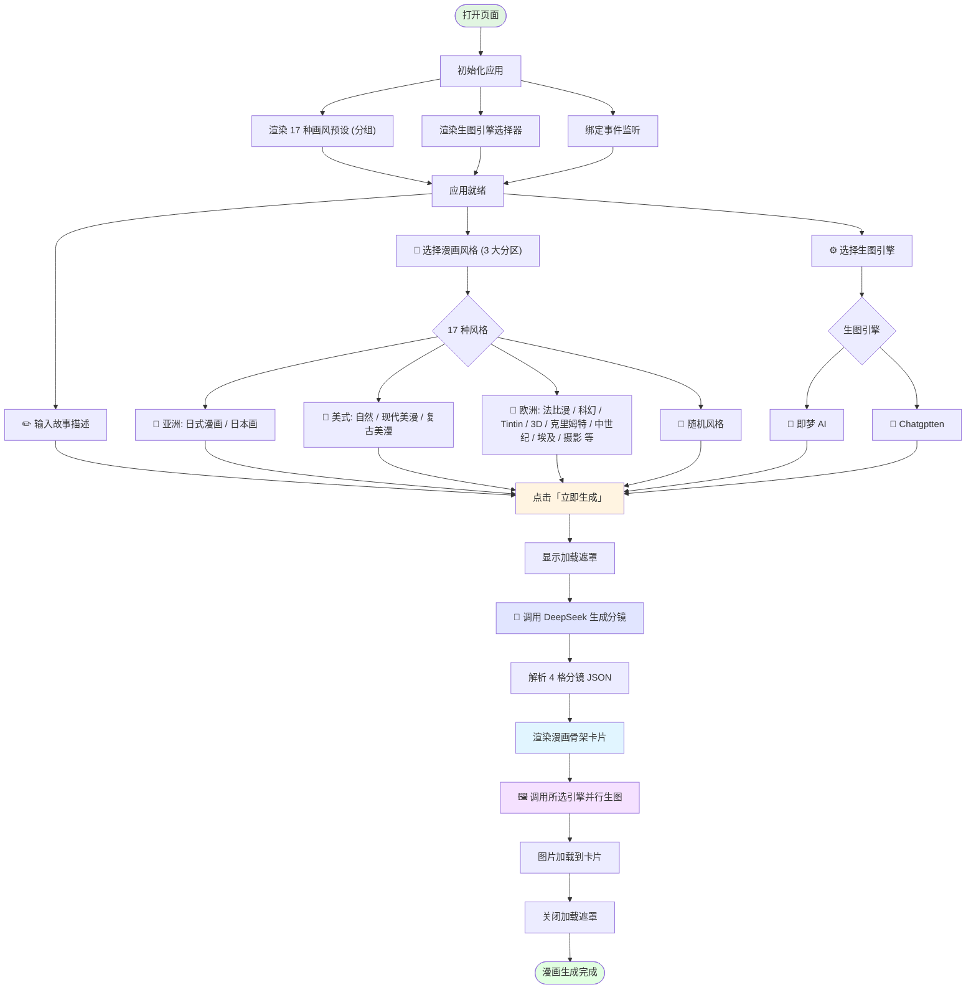
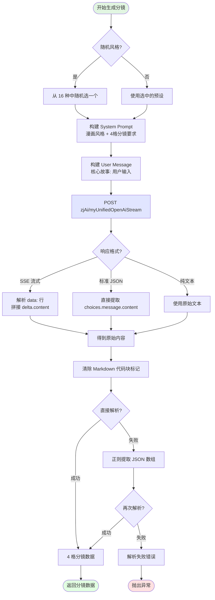
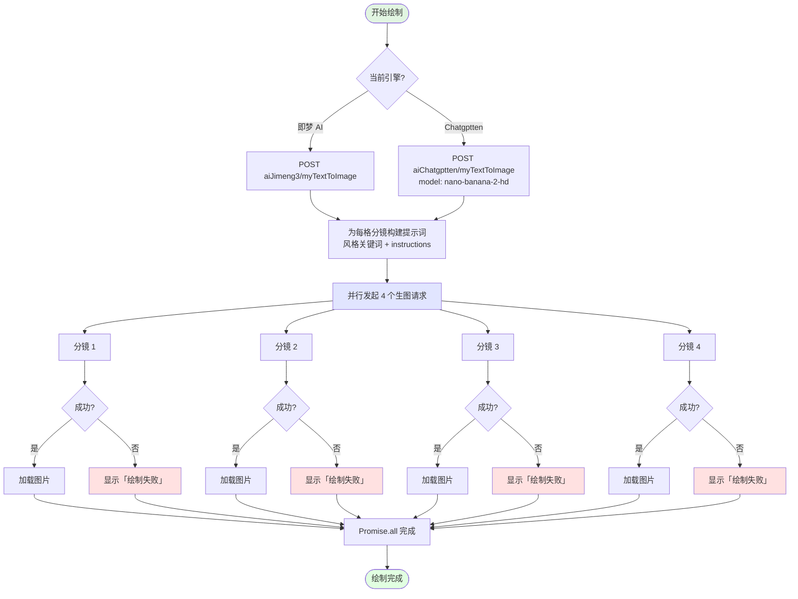
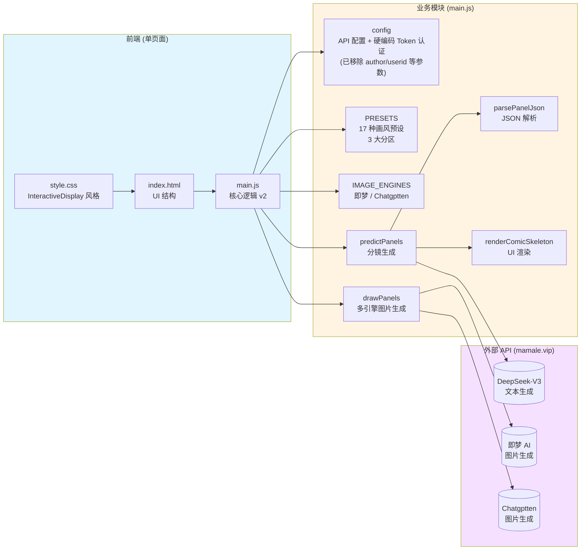

# AI 漫画生成器 — 工作流程图

## 主流程图

## DeepSeek 分镜生成详细流程

## 多引擎图片生成流程

## 认证机制设计说明 (v2)

为了解决本地单页应用直接调用跨域 API 时的 CORS（跨域资源共享）拦截问题，并剥离冗余的业务层参数，本项目的 API 认证机制已进行重构：

- **移除业务参数**：去除原始设计中依赖于具体用户的 `author`、`userid` 和 `username` 参数（原先通过 URL 查询字符串如 `?author=...&userid=...` 传递），使生成器具备更通用的公开沙盒特性。
- **生图引擎调用 (mamale.vip)**：不再通过自定义的 `__tenant` Header 发起请求（会触发 CORS 预检拦截），而是改用标准的 `Authorization: Bearer <Token>` 传递 JWT，同时将 `tenantid` (`__tenant`) 转移至 URL 查询参数中。
- **数据库存储调用 (520ai.cc)**：与生图 API 复用同一个 JWT Token，通过 `x-bm-token` Header 向 BaseMulti 发送鉴权请求，后台记录关联至指定的 `tenantid`，无需额外绑定 user 身份信息。
- **配置硬编码**：所有环境级 Token 与 Tenant 均直接硬编码在 `main.js` 头部的 `config` 与 `dbConfig` 中，方便直接启动即可体验。

## 架构图

---

*最后更新：2026-03-05*
