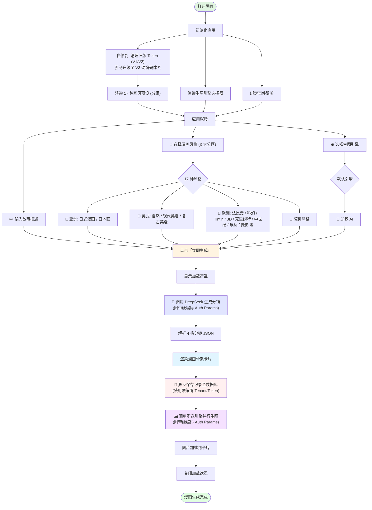
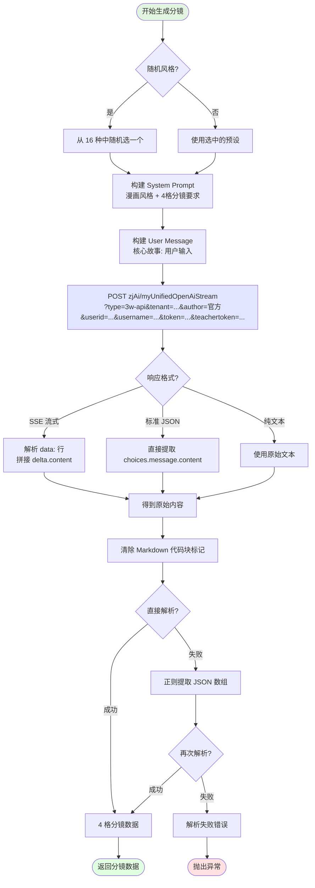
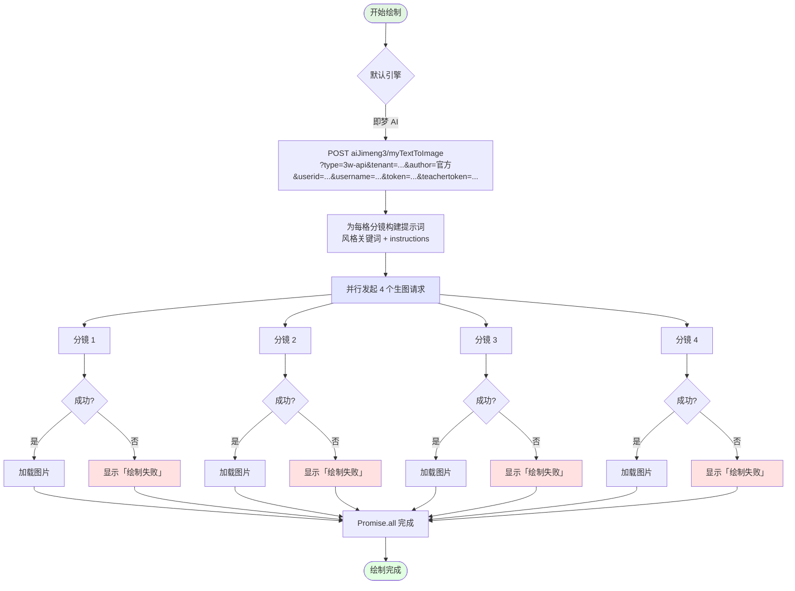
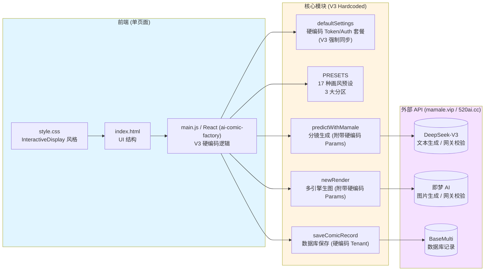

# AI 漫画生成器 — 工作流程图

## 主流程图

## DeepSeek 分镜生成详细流程

## 图片生成流程

## 认证机制设计说明 (v3)

为了兼容最新的网关策略并解决本地跨域 (CORS) 拦截问题，本项目的认证机制已升级至 **V3 硬编码体系**：

- **完全硬编码认证**：所有关键鉴权参数（`token`、`teachertoken`、`userid`、`username`、`tenantId`）均已硬编码至代码逻辑中，不再依赖 URL 查询字符串或不稳定的 `localStorage` 缓存。
- **强制同步强制刷新**：通过将 `localStorage` 版本提升至 `V3`，应用会强制跳过任何旧版缓存数据，确保所有请求均使用代码中定义的最新 Hardcoded Token。
- **网关全量参数对齐**：所有发往 `mamale.vip` 的 API 请求（包括 DeepSeek 分镜生成和多引擎生图）现在均会严格附带全量查询参数：`type=3w-api`、`author=官方`、`userid`、`username` 等，确保通过网关校验。
- **数据库存储一致性**：`saveComicRecord` (520ai.cc) 与核心引擎共用同一份硬编码 TenantID 与 Token，确保数据归属的一致性。
- **自动清理机制**：`main.tsx` 中的自修复逻辑会自动识别并移除过期的 `V1` 和 `V2` 存储项，实现平滑无感升级。

## 架构图

---

*最后更新：2026-03-06*
